# Agentic Production Framework — Architecture Design

## Table of Contents

- [1. Overview](#1-overview)
  - [1.1 How Users Interact with Agents (Chatbots)](#1-1-how-users-interact)
  - [1.2 Agent Architecture: Hierarchical Supervisor / Orchestrator](#1-2-agent-architecture)
- [2. High-Level Flow Diagram](#2-high-level-flow-diagram)
- [3. Request Flow (Sequence)](#3-request-flow-sequence)
- [4. Deployment Diagram](#4-deployment-diagram)
  - [4.1 One Cluster = Many Pools; Many Clusters](#4-1-one-cluster-many-pools)
  - [4.2 Deployment Summary](#4-2-deployment-summary)
  - [4.3 Why Multiple VMs / Pods per Agent Pool?](#4-3-why-multiple-vms-pods)
- [5. Layered Architecture (Detailed)](#5-layered-architecture)
  - [5.1 Layer 1 — Frontend Ingress](#5-1-layer-1-frontend-ingress)
  - [5.2 Layer 2 — Orchestrator (Supervisor)](#5-2-layer-2-orchestrator)
  - [5.3 Layer 3 — Agent Pools](#5-3-layer-3-agent-pools)
  - [5.4 Layer 4 — Shared Services](#5-4-layer-4-shared-services)
  - [5.4.1 AgentOps (Circuit Breaker, Failover, Health)](#5-4-1-agentops)
  - [5.5 Conversation History Query API (GraphQL)](#5-5-conversation-history-graphql)
  - [5.6 RAG Ingestion (PDF → Weaviate)](#5-6-rag-ingestion)
- [6. State and Data Flow Summary](#6-state-and-data-flow)
- [7. Implemented Code Artifacts](#7-implemented-code-artifacts)
- [8. Scaling and Efficiency (Recap)](#8-scaling-and-efficiency)
- [9. Runtime Correctness, Hallucination Detection & Observability](#9-runtime-correctness-observability)
  - [9.1 How We Measure "Correct" and "Not Hallucinating" at Runtime](#9-1-how-we-measure)
  - [9.2 Hallucination Handling Flow](#9-2-hallucination-handling-flow)
  - [9.3 Where Langfuse or LangSmith Fit](#9-3-langfuse-langsmith)
  - [9.4 Observability Flow in the Architecture](#9-4-observability-flow)
  - [9.5 Concrete Integration Points](#9-5-concrete-integration-points)
  - [9.6 Sample Matrix (Langfuse)](#9-6-sample-matrix)
  - [9.7 Summary](#9-7-summary)
- [10. Infrastructure & Performance Observability](#10-infrastructure-performance)
  - [10.1 How to Observe VM / Pod Performance](#10-1-observe-vm-pod)
  - [10.2 Key Performance Parameters to Observe](#10-2-key-performance-parameters)
  - [10.3 Where These Metrics Come From (Kubernetes)](#10-3-where-metrics-come-from)
  - [10.4 Dashboards: Grafana, AWS CloudWatch, and Azure Monitor](#10-4-dashboards)
  - [10.5 How This Fits With Langfuse / LangSmith](#10-5-fits-with-langfuse)
- [11. Diagram Summary](#11-diagram-summary)

---

<a id="1-overview"></a>
## 1. Overview

This document describes the **layered architecture** and **data flow** for a production-scale, LangGraph- and LLM-based agentic framework. The system is designed to support **thousands of customers** interacting with **hundreds of specialized agents** (e.g., customer support at scale), with centralized orchestration, dynamic routing, and horizontal scaling.

The framework uses **LangGraph** for orchestration and agent workflows, **LLMs** for reasoning and generation, and standard cloud components for ingress, state, and persistence. OVON is omitted in favor of LangGraph’s native state and message passing.

<a id="1-1-how-users-interact"></a>
### 1.1 How Users Interact with Agents (Chatbots)

**Yes — the primary interaction model is chat.** Users talk to the system through **chatbots**: multi-turn, conversational interfaces. From the user's point of view it's a single chat (e.g. a support chat); behind the scenes, the supervisor routes each message to the right agent(s).

**1. What the user sees: chatting with a chatbox**

```mermaid
flowchart LR
    subgraph UserSide["User"]
        U[👤 User]
    end
    subgraph ChatUI["Chat interface"]
        CB[💬 Chatbox]
        MSG[Message history]
        CB --- MSG
    end

    U -->|"Type message"| CB
    CB -->|"Send"| CB
    CB -->|"Show reply"| U
```



The user types in a **chatbox**; messages and replies appear in the same **conversation**. One continuous thread — like WhatsApp or a support widget.

**2. What happens behind the chatbox (from chat to agent and back)**

```mermaid
flowchart LR
    U[👤 User]
    CB[💬 Chatbox]
    GW[API Gateway]
    RTR[Session Router]
    SUP[Supervisor]
    AGT[Agent]
    RAG[RAG Doc + History]
    TOOLS[Tools]
    MCP[MCP Server]

    U <-->|chat| CB
    CB <-->|WebSocket / REST| GW
    GW --> RTR
    RTR --> SUP
    SUP --> AGT
    AGT <-->|doc + history| RAG
    AGT <-->|tool calls| TOOLS
    AGT <-->|tool calls| MCP
    AGT -->|reply| SUP
    SUP -->|reply| GW
    GW --> CB
```



Each message from the chatbox goes to the **gateway** → **router** (picks intent) → **supervisor** (picks which agent) → **agent** (uses **RAG** for docs + conversation history, **tools** + **MCP**) → back through **supervisor** → **gateway** → **chatbox** → user. The user only sees the chatbox; the rest is backend.

| Aspect | Description |
|--------|-------------|
| **What the user sees** | A **chat UI**: message box, conversation history, and agent replies. Same experience as talking to a human agent or a single bot. |
| **Where chat runs** | **Web app** (browser), **mobile app**, **embedded widget** (e.g. on your site), or **third-party channels** (Slack, Teams, WhatsApp) that send/receive messages via your API. |
| **Transport** | **WebSocket** for real-time: user sends a message, streamed or single reply; optional typing indicators. **REST** is possible (one request = one reply) but chat UX is better with WebSocket or long-polling. |
| **Session** | One **session_id** per conversation (or per user). All messages in that session share the same LangGraph state (supervisor + history) so context is kept across turns. |
| **Who answers** | The **supervisor** chooses which agent (Support, Billing, Tech, Escalation) answers each turn. The user does not pick an agent; routing is automatic by intent. Optionally, the UI can show "Connecting you to Billing…" when the agent changes. |

So: **users interact via chat UIs (chatbots)**; each message goes gateway → router → supervisor → chosen agent → reply back to the same chat. Multi-turn, one continuous conversation, with the backend handling routing and handoffs.

<a id="1-2-agent-architecture"></a>
### 1.2 Agent Architecture: Hierarchical Supervisor / Orchestrator

This framework uses a **hierarchical supervisor / orchestrator** architecture. One central **supervisor** (orchestrator) sits at the top and controls all routing and handoffs; **specialized agents** (Support, Billing, Tech, Escalation) sit below and perform domain-specific work. The supervisor decides which agent handles each turn; agents do not talk to each other directly — all coordination flows through the supervisor.

**Hierarchical structure diagram**

```mermaid
flowchart TB
    subgraph Top["Orchestrator Layer (top)"]
        SUP[Supervisor / Orchestrator<br/>LangGraph<br/>plan → route → invoke_agent → aggregate]
    end

    subgraph Bottom["Agent Pool Layer (below)"]
        SP[Support Agent<br/>tool use or ReAct]
        BP[Billing Agent<br/>tool use or ReAct]
        TP[Tech Agent]
        EP[Escalation Agent]
    end

    subgraph RAGLayer["RAG (Doc + History)"]
        DOC[RAG Doc]
        HIST[History RAG]
    end

    subgraph ToolsLayer["Tools + MCP (required)"]
        TOOLS[LangChain Tools]
        MCP[MCP Server]
    end

    SUP -->|"dispatch"| SP
    SUP -->|"dispatch"| BP
    SUP -->|"dispatch"| TP
    SUP -->|"dispatch"| EP
    SP -->|"reply"| SUP
    BP -->|"reply"| SUP
    TP -->|"reply"| SUP
    EP -->|"reply"| SUP
    SP <-->|"tool calls"| ToolsLayer
    SP <-->|"doc + history"| RAGLayer
    BP <-->|"tool calls"| ToolsLayer
    BP <-->|"doc + history"| RAGLayer
```



- **Top:** One **Supervisor** — holds global state; when **USE_PLANNING** is enabled, a **plan** node runs first (LLM picks which agent should handle the turn), then **route** → **invoke_agent** → **aggregate**. Otherwise entry goes straight to route.
- **Bottom:** Specialized **agents** — Support, Billing, Tech, Escalation. Each uses **tool use** (tool-calling loop) by default; when **USE_REACT** is enabled, agents use a **ReAct** loop (Thought → Action → Action Input → Observation) until Final Answer.
- **RAG (Doc + History):** Agents use **Doc RAG** (KB/docs) and **History RAG** (last N turns for issue handling).
- **Tools + MCP:** Agents use **LangChain tools** (built-in) and **MCP** (required) for tool calls (e.g. search_knowledge_base, look_up_invoice).

**Implementation mapping (this repo):** The “Tools” and “MCP Server” boxes in the diagrams map as follows. **Tools** = built-in LangChain tools in `src/tools/support_tools.py` and `src/tools/billing_tools.py`; the app merges them with MCP tools via `src/tools/mcp_client.py`. **MCP Server** = the in-repo server in `mcp_server/` (run with `python -m mcp_server`; register tools in `mcp_server/server.py`) or any external MCP server you run at `MCP_SERVER_URL`. The client loads tools from that URL and merges them with the built-in set.

So: **supervisor / orchestrator = hierarchical** — supervisor on top, agents below; one agent per turn; all coordination through the supervisor; agents use tools and MCP.

---

<a id="2-high-level-flow-diagram"></a>
## 2. High-Level Flow Diagram


**AgentOps:** Dispatch passes through circuit breaker (skip open circuits); on failure, failover to fallback agent. Health: `GET /health` reports agent and MCP status (§5.4.1). **Planning** and **ReAct** are implemented and optional: enable with `USE_PLANNING` and `USE_REACT`; see §5.3 (Optional agent patterns).

---

<a id="3-request-flow-sequence"></a>
## 3. Request Flow (Sequence)


---

<a id="4-deployment-diagram"></a>
## 4. Deployment Diagram

Agents and supervisors are deployed across **multiple VMs, containers, and regions**. The diagram below shows how the main components are placed on infrastructure: load balancer, regional gateways, **supervisor replicas** (e.g. Kubernetes pods), **agent pools** (each pool with multiple instances on VMs or pods), and shared services (Redis, Weaviate, DynamoDB).

**Clusters and pools:**

- **One Kubernetes cluster → many pools.** A single cluster runs **all** agent pool types (Support, Billing, Tech, Escalation) plus the supervisor pool. Each pool is a separate Kubernetes Deployment (or similar); each has multiple pod replicas. So one cluster contains many workloads: one “supervisor” deployment and several “agent pool” deployments.
- **Many clusters.** You run **multiple** such clusters: typically **one cluster per region** (e.g. US-East cluster, EU-West cluster, APAC cluster), or more than one cluster per region if you need extra capacity. The global load balancer sends traffic to the right region; within that region, one cluster holds all supervisors and all agent pools for that region.


<a id="4-1-one-cluster-many-pools"></a>
### 4.1 One Cluster = Many Pools; Many Clusters

| Question | Answer |
|----------|--------|
| **In one Kubernetes cluster, how many pools?** | **Many.** One cluster runs the **supervisor pool** (many pods) and **all agent pools** (Support, Billing, Tech, Escalation). Each pool is a separate Deployment with multiple replicas (e.g. Support: 10 pods, Billing: 5 pods, Tech: 8 pods, Escalation: 3 pods) in the **same** cluster. |
| **How many clusters?** | **Many.** Typically **one cluster per region** (e.g. US-East, EU-West, APAC). For very high scale, you can run **multiple clusters per region** (e.g. US-East-A, US-East-B). The load balancer routes users to a region; that region’s cluster has all pools. |

So: **one cluster = many pools (supervisor + all agent types); many clusters = one per region (or more for capacity).**

<a id="4-2-deployment-summary"></a>
### 4.2 Deployment Summary

| Component | Deployment model | Scale / placement |
|-----------|------------------|-------------------|
| **Global Load Balancer** | Managed (e.g. AWS ALB, Cloudflare) | Single entry; routes to regions by geography/latency. |
| **API Gateway** | Managed or VMs per region | One or more instances per region; rate limit, auth, WebSocket. |
| **Session Router** | Containers or serverless (e.g. Lambda/Fargate) | Multiple replicas per region; stateless; scale on request rate. |
| **Supervisor** | Kubernetes pods (or VM group) | 10–100+ pods **per cluster**; partition by `session_id` or `user_id`; state in Redis/checkpointer. |
| **Agent pools** | **Multiple pods per pool, all in same cluster** | Support / Billing / Tech / Escalation as separate Deployments **in the same cluster**; 2–50+ instances per pool; scale by domain and load (e.g. 80% CPU → add pods). |
| **Redis** | Cluster (e.g. ElastiCache) | Per region or multi-AZ; session state, checkpointer; 1M+ ops/sec. |
| **Weaviate** | Vector DB for RAG + intent | Per region or global; RAG + intent index; &lt;100ms retrieval. |
| **DynamoDB** | Managed table(s) | Global or multi-region; conversation history, agent registry. |

<a id="4-3-why-multiple-vms-pods"></a>
### 4.3 Why Multiple VMs / Pods per Agent Pool?

- **Throughput:** Many concurrent users; one VM/pod per pool would be a bottleneck. Multiple instances spread load (e.g. 10k users → 100+ agent instances across pools).
- **Isolation:** Billing agents can scale independently from support; a spike in billing queries does not starve support.
- **Availability:** If one instance fails, others in the same pool continue; combined with circuit breakers and health checks, pools stay available.
- **Geo / latency:** Agents can be deployed per region (e.g. EU-West, APAC); users are routed to the nearest gateway and, if desired, to regional agent instances.

This deployment view complements the logical flow (Section 2) and request sequence (Section 3): the same supervisors and agents shown there run on **multiple VMs and pods** as in this diagram.

---

<a id="5-layered-architecture"></a>
## 5. Layered Architecture (Detailed)

<a id="5-1-layer-1-frontend-ingress"></a>
### 5.1 Layer 1 — Frontend Ingress

**Purpose:** Single entry point for all user traffic; route to the right conversation and supervisor instance.

| Component | Role |
|-----------|------|
| **Global Load Balancer** | Distributes traffic across regions (e.g., AWS ALB, Cloudflare). |
| **Regional API Gateway** | Auth, rate limiting (e.g., 100 req/min per user), WebSocket upgrade for chat. |
| **Session Router** | Classifies intent and returns target agent pool in **&lt;50ms** without an LLM call. Implementations: **keyword** (stub), **TensorFlow** (small Keras model), or **embed → Weaviate** (production semantic). |

**Implemented:**

- **Session Router** service/function:
  - Input: `user_id`, `message`, optional `session_id`.
  - **Intent options:** **Keyword** (`KeywordIntentClassifier` — maps keywords to agent IDs, default), **TensorFlow** (`TFIntentClassifier` — small Keras model; set `USE_TF_INTENT=true`; trains from synthetic data or loads from `TF_INTENT_MODEL_PATH`; falls back to keyword if unavailable), **Weaviate** (production option: embed message → query Weaviate for agent pool IDs).
  - Output: `session_id`, `suggested_agent_pool_ids`, `embedding_cache_key` (for intent caching).
- **Gateway contract:** REST/WebSocket API shape (paths, auth, rate limits) is defined so the rest of the system can integrate.

---

<a id="5-2-layer-2-orchestrator"></a>
### 5.2 Layer 2 — Orchestrator (Supervisor)

**Purpose:** One “brain” per conversation: maintain global state, decide which agent(s) handle each turn, sequence multi-agent handoffs, and manage escalations.

| Component | Role |
|-----------|------|
| **Supervisor Agent** | LangGraph workflow that holds **global conversation state**, routes to specialized agents, and aggregates results. |
| **Agent Registry** | Metadata store (e.g., DynamoDB or in-memory) of agent capabilities, models, and limits. |

**Implemented:**

- **Supervisor LangGraph graph:**
  - **State:** `messages`, `current_agent`, `session_id`, `user_id`, `last_rag_context`, `metadata` (e.g., escalation flag, resolved intents).
  - **Nodes:** `route` (uses router suggestion or LLM to pick agent), `invoke_agent` (calls the chosen pool; agents return `last_rag_context`), `aggregate` (runs **FaithfulnessScorer** on response + last_rag_context; if score &lt; threshold sets needs_escalation), `escalate` (optional).
  - **Edges:** Conditional from `route` to agent nodes; from each agent back to `aggregate`; optional `aggregate` → `route` for next turn.

**FaithfulnessScorer(response, last_rag_context) — how it works**

- **What is passed:** After an agent runs, the **invoke_agent** node puts the agent’s reply into `messages` and the agent’s **RAG doc context** (the retrieved chunks used to answer) into state as **`last_rag_context`**. The **aggregate** node then takes (1) **response** = text of the last AI message in state, and (2) **context** = `state["last_rag_context"]`.
- **What the scorer does:** **FaithfulnessScorer.score(response, context)** returns a float in [0, 1]: how well the response is grounded in the context (high = faithful, low = possible hallucination or contradiction). Default implementation is **StubFaithfulnessScorer** (always 1.0). With **USE_TF_FAITHFULNESS=true**, **TFFaithfulnessScorer** uses a small TensorFlow model (or trains from synthetic data) to score the pair; see CODE_WALKTHROUGH §3.16 for input format and training.
- **How the result is used:** If `score < config.hallucination_threshold_faithfulness` (default 0.8), the aggregate node sets **needs_escalation=True**. The graph then follows the **escalate** edge (e.g. “Connecting you with a human agent”) instead of returning the reply to the user. So low faithfulness triggers escalation rather than showing a possibly hallucinated answer.

**Human-in-the-loop (HITL) — implemented**

When the graph follows the **escalate** edge (low faithfulness or agent-requested escalation), the **escalate** node delegates to a **HITL handler** so the system can create tickets, send notifications, or enqueue for humans. Implemented in a separate module **`src/hitl/`**:

| Component | Role |
|-----------|------|
| **HitlHandler** (base) | Abstract interface: `on_escalate(ctx: EscalationContext)`. `EscalationContext` holds `session_id`, `user_id`, `reason` (e.g. `low_faithfulness`, `agent_requested`), `last_user_message`, `last_agent_message`, `metadata`. |
| **StubHitlHandler** | No-op; used when HITL is disabled or for testing. |
| **TicketHitlHandler** | Calls `create_support_ticket` (support tools) to create a ticket; keeps a **pending escalations** map (session_id → ticket info). Exposes `get_pending_escalations()` and `clear_pending_escalation(session_id)` for dashboards or human queues. |
| **EmailNotifyHitlHandler** | Logs escalation; optional `email_to` (SMTP not implemented). |

**Config:** `HITL_ENABLED` (default true), `HITL_HANDLER` (`stub` \| `ticket` \| `email`; default `ticket`), `HITL_EMAIL_TO` (for email handler). The supervisor builds the handler via `get_hitl_handler(config.hitl_handler, config.hitl_enabled, config.hitl_email_to)` and passes it into the graph; **escalate_node** builds `EscalationContext` from state and calls `handler.on_escalate(ctx)` (in try/except), then returns the same AIMessage: "I'm connecting you with a human agent. Please hold."

**API:** When `HITL_HANDLER=ticket`, **GET /hitl/pending** returns the list of pending escalations; **POST /hitl/pending/{session_id}/clear** marks a session as picked up (removes from pending).

- **Agent Registry interface:** `get_agents_by_capability(capabilities: list[str])` → list of agent configs. Fields: `agent_id`, `capabilities`, `model`, `max_concurrent`, `latency_p99` (for observability).
- **Scaling:** Supervisor is stateless; state lives in **checkpointer** (Redis/Postgres). Partitioning by `user_id` or `session_id` for horizontal scale.

---

<a id="5-3-layer-3-agent-pools"></a>
### 5.3 Layer 3 — Agent Pools

**Purpose:** Domain-specific work (support, billing, tech, escalation); stateless, sharded by domain/geo; invoked by the supervisor.

| Component | Role |
|-----------|------|
| **Specialized Pools** | Support, Billing, Tech, Escalation (and more as needed). |
| **Stateless containers** | Each agent runs as a LangGraph subgraph or tool-callable workflow (e.g., FastAPI + LangGraph). |
| **Pool sharding** | By domain (billing_pool_1..N) and optionally by region (eu_billing_pool, us_billing_pool). |

**Implemented:**

- **Per-pool LangGraph subgraph** (callable node):
  - Input: current state slice (messages, user query, context from RAG, **conversation history**).
  - Steps: **conversation history RAG** (retrieves last N turns for issue handling) → RAG retrieval (docs) → LLM call **with tools** (tool-calling loop) → structured response.
  - Output: updated messages + metadata (e.g., `resolved`, `needs_escalation`).
- **Inter-agent communication:** LangGraph **state and messages** only (no OVON). Supervisor passes state in; agent returns state out.
- **Model tiering:** e.g., GPT-4o-mini for most turns, GPT-4o for complex or escalation paths (configurable per pool in registry).

**Tools assigned to agents (implemented):**

| Agent | Tools | Purpose |
|-------|-------|---------|
| **Support** | `search_knowledge_base`, `create_support_ticket` | Search FAQ/KB; create ticket for human follow-up. |
| **Billing** | `look_up_invoice`, `get_refund_status`, `create_refund_request` | Invoice lookup; refund status; submit refund request. |

Tools are **LangChain tools** bound to the LLM via `bind_tools()`; each agent runs a **tool-calling loop** (invoke → execute tool calls → add ToolMessage → invoke again until done).

**RAG for history (issue handling):** Agents use **ConversationHistoryRAG** to retrieve the last N turns and include them in the prompt. This lets agents understand the ongoing issue (e.g. invoice ID, order ID mentioned earlier) and avoid repeating themselves. Simple impl: last N turns; production: vector search over embedded turns. **ConversationStore** persists turns for long-term history and analytics.

**MCP (Model Context Protocol) — required.** Tools are loaded from an **MCP server** (e.g. streamable-http at `MCP_SERVER_URL`). The `langchain-mcp-adapters` library converts MCP tools into LangChain tools and merges them with the built-in tools above. `MCP_SERVER_URL` must be set; the system fails to start if MCP is not configured or unreachable. The architecture diagrams in §1.1, §1.2, §2, and §3 show **Tools** and **MCP Server** as separate boxes; in this repo, built-in tools live in `src/tools/`, the MCP client in `src/tools/mcp_client.py`, and you can run the in-repo MCP server from `mcp_server/` (register tools in `mcp_server/server.py`; see `mcp_server/README.md`).

**Optional agent patterns: ReAct and Planning (implemented, enabled via env)**

Both patterns are **implemented** and can be enabled with environment variables:

| Pattern | Where implemented | Env / config | Behavior |
|--------|--------------------|--------------|----------|
| **Planning** | **Supervisor** (`src/supervisor.py`): **plan** node runs first when enabled. LLM is asked which single agent (support or billing) should handle the user message; result is stored as `planned_agent_ids`. **Route** then uses that (or router suggestions when planning is off). | `USE_PLANNING=true` (default: false) | Entry → **plan** → route → invoke_agent → aggregate. Plan node no-op when disabled. |
| **ReAct** | **Support and Billing agents** (`src/agents/support.py`, `billing.py`): When enabled, agents use a **ReAct** loop instead of the standard tool-calling loop. Model outputs "Thought:", "Action:", "Action Input:"; we run the tool and feed "Observation:"; repeat until "Final Answer:". | `USE_REACT=true` (default: false), `REACT_MAX_STEPS` (default: 10) | Interpretable reasoning traces; same tools, different invocation style. |

**Agent patterns (optional) — Planning and ReAct flow**


- **Planning:** When `USE_PLANNING=true`, the **plan** node runs before **route** and sets `planned_agent_ids` from an LLM call; **route** uses that to choose `current_agent`. When false, entry goes to **route** and behavior is unchanged (router suggestions only).
- **ReAct:** When `USE_REACT=true`, each agent uses `_invoke_react()` (Thought → Action → Action Input → Observation loop) instead of `_invoke_with_tools()`. Same tools; the model outputs structured text that we parse and execute.

---

<a id="5-4-layer-4-shared-services"></a>
### 5.4 Layer 4 — Shared Services

**Purpose:** Grounding, session state, and long-term persistence used by both the supervisor and agent pools.

| Component | Role |
|-----------|------|
| **RAG Vector Store** | Document retrieval for grounding (Weaviate); &lt;100ms, used by agents. |
| **Guardrails** | Input/output filtering: block off-topic or policy-violating content; `guard_input` and `guard_output` in agent nodes. |
| **Session Cache** | Redis: short-term conversation history and supervisor state; TTL e.g. 24h; high throughput. |
| **Conversation Store** | DynamoDB (or equivalent): long-term conversation history for analytics and replay. |
| **Analytics / Monitoring** | Metrics (latency, queue depth, errors) and optional “analytics agents” for SLA or hallucination monitoring. |

**Implemented:**

- **RAG service interface:** `retrieve(query: str, top_k: int, filters?: dict)` → list of chunks. Production implementation uses **Weaviate**.
- **Intent classifier interface:** `IntentClassifier.classify(message)` → suggested agent pool IDs. Implementations: `KeywordIntentClassifier`, `TFIntentClassifier` (TensorFlow/Keras), or Weaviate-based semantic lookup.
- **Faithfulness scorer interface:** `FaithfulnessScorer.score(response, context)` → 0–1. **TFFaithfulnessScorer** (TensorFlow/Keras) is used in supervisor aggregate when `USE_TF_FAITHFULNESS=true`; default `StubFaithfulnessScorer` returns 1.0.
- **Guardrail service:** `guard_input(text)` and `guard_output(text)` block off-topic or policy-violating content; `SimpleGuardrailService` for keyword-based checks, or a third-party library for stronger detection. **Prompt-injection / unlawful behavior:** To reduce the risk of users manipulating the agent (e.g. “ignore previous instructions”, jailbreak phrases), `guard_input` also blocks common injection patterns and rejects very long input. Agent system prompts instruct the model to not follow instructions embedded in the user message and to refuse out-of-scope requests. For production, you can plug in one of the following **libraries and tools** (all implement or complement input/output guardrails and prompt-injection detection):

  | Library / tool | What it does | Notes |
  |----------------|--------------|--------|
  | **Guardrails AI** | Validators (e.g. `detect_prompt_injection`), Pydantic output parsing, topic/toxicity checks. | Python; validator hub; can replace or wrap `GuardrailService`. |
  | **LLM Guard** (Protect AI) | Input/output sanitization, harmful content detection, prompt-injection resistance, data leakage prevention. | Open-source; pip install; production-oriented. |
  | **Rebuff** | Prompt-injection detector (heuristics + optional LLM). | Python & JS SDKs; playground at rebuff.ai. |
  | **OpenAI Guardrails (Python)** | LLM-based prompt-injection detection; validates outputs and tool calls at configurable checkpoints. | OpenAI’s guardrails package; confidence thresholds, optional reasoning. |
  | **Giskard** | **LLM Scan**: automated security testing for LLMs (prompt injection, robustness). Heuristics + LLM-assisted detectors; tests for character injection, jailbreaks, RAG/QA vulnerabilities. | Open-source; Python; good for pre-release scanning and CI; maintains prompt-injection dataset on GitHub (`giskard-ai/prompt-injections`). |
  | **OWASP LLM Prompt Injection Cheat Sheet** | Patterns, attack vectors (direct/indirect injection, encoding, jailbreaks), and mitigation guidance. | Reference only; no library. |

  **Runtime vs CI/scan:** **Runtime guardrails** (Guardrails AI, LLM Guard, Rebuff, OpenAI Guardrails, or in-repo `SimpleGuardrailService`) run **on every user request** in production: the agent calls `guard_input(user_message)` and `guard_output(agent_reply)` in the request path, so live traffic is checked and blocked or filtered in real time. **Giskard** is different: it is used for **offline / CI scanning** only (e.g. run a security scan in tests or before release). Giskard does **not** sit in the production request path and does **not** check each user request continuously; it helps find vulnerabilities in your agent before you deploy. For continuous protection in production, use a runtime guardrail; for pre-release checks, add Giskard (or similar) to your CI pipeline. You can use both: runtime guardrails on every request plus Giskard in CI to catch new attack patterns.

  The in-repo `SimpleGuardrailService` remains a lightweight, dependency-free option; for stricter security, implement `GuardrailService` using one of the runtime libraries above or combine keyword rules with an LLM-based classifier.
- **Session store interface:** `get(session_id)`, `set(session_id, state, ttl)`, used by LangGraph checkpointer.
- **Conversation store interface:** `append_turn(session_id, role, content, metadata)`, `get_history(session_id)`, `list_sessions(limit)`.
- **AgentOps:** Circuit breaker, failover, and health (see §5.4.1).

<a id="5-4-1-agentops"></a>
### 5.4.1 AgentOps (Circuit Breaker, Failover, Health)

**Purpose:** Keep the system available when one or more agent pools fail. AgentOps provides **circuit breakers** (stop calling failing agents for a cooldown period), **failover** (try a fallback agent on failure), and a **health endpoint** that reports agent and MCP status so load balancers and runbooks can react.

**Reactive circuit breaking (no proactive health checks)**

The supervisor **does not** run background health checks or ping agents. Circuit state is updated **only when the supervisor invokes an agent** as part of handling a user request: success → `record_success` (circuit stays closed or closes from half_open); exception → `record_failure` (after N consecutive failures, circuit opens). So “agent unhealthy” means “the last N **invocations** of that agent failed”; there is no separate health-check loop. This **reactive** approach is the standard circuit-breaker model (e.g. Nygard, Hystrix, resilience4j): the circuit wraps the real call and opens/closes from call outcomes. Optional **proactive** health checks (e.g. a background task that periodically pings agents) could be added on top; they are not implemented here.

**How circuit state is updated (reactive only)**


- **Route** only *reads* circuit state (skip agents with circuit open). It does not *update* state.
- **Invoke** is the only place that *updates* state: after each agent call, we call `record_success` or `record_failure`. So “health” is inferred from invocation outcomes, not from a separate check.

**Implemented (this repo):**

| Component | Role |
|-----------|------|
| **Circuit breaker** | Per-agent state: **closed** (normal), **open** (too many failures; do not call), **half_open** (cooldown elapsed; allow one probe). State is updated **only on invocation** (reactive; no background health checks). After `CIRCUIT_BREAKER_FAILURE_THRESHOLD` consecutive failures, circuit opens; after `CIRCUIT_BREAKER_COOLDOWN_SECONDS`, it becomes half_open; one success closes it, one failure re-opens it. Implemented in `src/agent_ops/circuit_breaker.py`. |
| **Route** | When AgentOps is enabled, the supervisor **route** node skips agents whose circuit is **open**, so traffic is not sent to a known-bad pool. |
| **Invoke + failover** | On agent invocation failure: record failure (circuit breaker), then if **failover** is enabled, invoke the **fallback agent** (default: `support`). If fallback also fails, return a friendly message and set `needs_escalation`. Success is recorded so the circuit can close. |
| **Health endpoint** | `GET /health` returns `{"status": "ok" \| "degraded", "agents": {agent_id: "healthy" \| "circuit_open" \| "half_open"}, "mcp": "ok" \| "unavailable"}`. Returns **503** when status is **degraded** (e.g. at least one agent circuit_open or MCP down), so load balancers can mark the instance unhealthy or alert. |

**Configuration (env):**

| Env var | Default | Description |
|---------|---------|-------------|
| `AGENT_OPS_ENABLED` | `true` | Enable circuit breaker and failover. |
| `CIRCUIT_BREAKER_FAILURE_THRESHOLD` | `3` | Consecutive failures before opening the circuit. |
| `CIRCUIT_BREAKER_COOLDOWN_SECONDS` | `60` | Seconds before transitioning open → half_open. |
| `FAILOVER_ENABLED` | `true` | On agent failure, try fallback agent. |
| `FAILOVER_FALLBACK_AGENT_ID` | `support` | Agent to use when primary fails. |
| `AGENT_INVOCATION_TIMEOUT_SECONDS` | `30` | Reserved for future per-call timeout. |

**AgentOps flow (circuit breaker + failover)**


**Health response (example):**

- **All healthy:** `200` — `{"status": "ok", "agents": {"support": "healthy", "billing": "healthy"}, "mcp": "ok"}`.
- **One agent circuit open:** `503` — `{"status": "degraded", "agents": {"support": "healthy", "billing": "circuit_open"}, "mcp": "ok"}`.

**Files:** `src/agent_ops/` (circuit_breaker, health), `src/config.py` (AgentOps env), `src/supervisor.py` (route filter + invoke failover), `src/api.py` (circuit breaker wiring, `/health` payload).

<a id="5-5-conversation-history-graphql"></a>
### 5.5 Conversation History Query API (GraphQL)

**Purpose:** Expose conversation history for dashboards, admin UIs, and analytics via a read-only GraphQL API so clients can request exactly the fields they need (e.g. session list, or full turns for a session).

**Ways you can say it:**
- “GraphQL is used to **query** user chat history (and list sessions).”
- “GraphQL is used to **retrieve** user chat history for dashboards and analytics.”
- “GraphQL is used to **access** user chat history so UIs can show past conversations.”

**Request flow (GraphQL conversation history)**


**Schema shape (types and queries)**


| Aspect | Description |
|--------|-------------|
| **Endpoint** | `POST /graphql` (Strawberry GraphQL on FastAPI). |
| **Implementation** | `strawberry-graphql[fastapi]`; schema and resolvers in `src/graphql/conversation_schema.py`; same `ConversationStore` instance as the chat API. |
| **Queries** | **`conversation(session_id: String!, limit: Int)`** → `Conversation` (session_id, turns with role, content, metadata_json); returns `null` if session not found. **`sessions(limit: Int)`** → list of `SessionInfo` (session_id) for recent sessions (e.g. for admin or dropdown). |
| **Types** | `Turn` (role, content, metadata_json), `Conversation` (session_id, turns), `SessionInfo` (session_id). |
| **Context** | GraphQL context provides `conversation_store` so resolvers call `get_history` and `list_sessions` on the shared store. |

<a id="5-6-rag-ingestion"></a>
### 5.6 RAG Ingestion (PDF → Weaviate)

**Purpose:** Populate the Weaviate RAG collection from PDF files so agents can retrieve grounded context. Implemented in `src/ingestion/` (CLI: `python -m src.ingestion --input-dir docs`).

**Ingestion pipeline**


**Chunking strategy (overlap and boundaries)**


| Step | Description |
|------|-------------|
| **Load** | PDFs are read from a directory (e.g. `docs/`); text is extracted per page via **pypdf**. |
| **Chunk** | Text is split into overlapping segments using **boundary-aware, character-based chunking** (see above). |
| **Write** | Chunks are inserted into Weaviate with properties `content` and `source` (filename); **text2vec-openai** vectorizer embeds them on insert. |

**Chunking strategy (detail):** Overlapping, boundary-aware, character-based (not token- or embedding-based). Target **chunk size** (default 500 characters) and **overlap** (default 50 characters) are configurable via `--chunk-size` and `--overlap`. Chunk boundaries are snapped to the nearest break in this order: paragraph (`\n\n+`), newline (`\n`), sentence end (`[.!?]\s+`), then space (`\s+`), so chunks do not cut mid-word. Chunks shorter than a minimum (20 characters) are skipped. This keeps retrieval units readable and avoids fragmenting sentences.

---

<a id="6-state-and-data-flow"></a>
## 6. State and Data Flow Summary

| Where | What is stored | Backing |
|-------|----------------|--------|
| **Router** | Intent embedding cache (optional) | Redis or Weaviate |
| **Supervisor** | Global conversation state, current agent, metadata | LangGraph checkpointer → Redis |
| **Agents** | Local turn state (input/output messages) | In-memory per request; no long-lived agent state |
| **Shared** | Session history, full conversation | Redis (hot) + DynamoDB (cold) |

Data flow in one turn:

1. **User message** → Gateway → Session Router (intent: keyword / TF / Weaviate) → **Supervisor**.
2. **Supervisor** loads state from checkpointer; uses **Agent Registry** to choose agent; invokes **Agent Pool** (subgraph/tool).
3. **Agent** optionally calls **RAG**; calls **LLM**; returns messages + metadata to supervisor.
4. **Supervisor** updates state; persists to **Redis** (session) and **DynamoDB** (history); responds to user.

---

<a id="7-implemented-code-artifacts"></a>
## 7. Implemented Code Artifacts

The following components are **implemented** and form the core of the system:

| # | Artifact | Description |
|---|----------|-------------|
| 1 | **Session Router** | Intent classification → suggested agent pool IDs and session_id. Keyword (`KeywordIntentClassifier`) or TensorFlow (`TFIntentClassifier`, `USE_TF_INTENT`). Production option: embed → Weaviate query. |
| 2 | **Agent Registry** | Interface + in-memory implementation: register agents, query by capability. |
| 3 | **Supervisor Graph** | LangGraph graph: state schema, nodes (route, invoke_agent, aggregate, escalate), edges, and checkpointer integration. |
| 4 | **Agent Pool Subgraphs** | One per pool type (Support, Billing): RAG + LLM **with tools** (tool-calling loop), input/output state. |
| 5 | **Tools** | **Support:** `search_knowledge_base`, `create_support_ticket`. **Billing:** `look_up_invoice`, `get_refund_status`, `create_refund_request`. LangChain tools in `src/tools/support_tools.py`, `billing_tools.py`; **MCP required** — MCP client in `src/tools/mcp_client.py` loads tools from `MCP_SERVER_URL` and merges with built-in. In-repo MCP server: `mcp_server/` (run `python -m mcp_server`; register tools in `mcp_server/server.py`). See `mcp_server/README.md`. |
| 5a | **RAG (docs + history)** | **Doc RAG:** `RAGService.retrieve(query)` for KB/docs. **History RAG:** `ConversationHistoryRAG` — last N turns for issue handling. **ConversationStore** persists turns for long-term history. |
| 5b | **AgentOps** | **Circuit breaker** (per-agent: closed/open/half_open), **failover** (fallback agent on failure), **health** (`GET /health` returns agent and MCP status; 503 when degraded). Config: `AGENT_OPS_ENABLED`, `CIRCUIT_BREAKER_*`, `FAILOVER_*`. See §5.4.1. |
| 5c | **HITL (human-in-the-loop)** | **`src/hitl/`** module: `HitlHandler` ABC, `EscalationContext`; handlers: stub, ticket (create_support_ticket + pending list), email_notify. Supervisor **escalate_node** calls handler `on_escalate(ctx)`. Config: `HITL_ENABLED`, `HITL_HANDLER`, `HITL_EMAIL_TO`. **GET /hitl/pending**, **POST /hitl/pending/{session_id}/clear** for human queue. |
| 6 | **Shared Service Interfaces** | RAG, session cache, conversation store: abstract interfaces with in-memory or minimal implementations. |
| 7 | **Entrypoint / API** | FastAPI app: receives message → calls router → runs supervisor graph → returns response. **GraphQL** at `/graphql` for conversation history: queries `conversation(session_id, limit)` and `sessions(limit)`; see §5.5. **Health** at `GET /health` with AgentOps status (§5.4.1). **HITL** at `GET /hitl/pending` and `POST /hitl/pending/{session_id}/clear`. |

Optional extensions (some as stubs or for future work):

- **MCP (Model Context Protocol) — required:** Load tools from an MCP server (`MCP_SERVER_URL`); `langchain-mcp-adapters` merges MCP tools with built-in tools. System fails if MCP is not configured. Use the in-repo server `mcp_server/` to register MCP tools (see Architecture diagrams “Tools + MCP” and implementation mapping in §1.2).
- **Async queue (Kafka/SQS):** Decouple gateway → supervisor and supervisor → agent for high throughput.
- **Circuit breaker:** Wrap agent calls; on failure, mark pool unhealthy in registry.
- **Model tiering:** Config in registry (e.g., `model: "gpt-4o-mini"` vs `"gpt-4o"`) and use in agent nodes.
- **top_p (nucleus sampling):** Passed to LLM at generation time (`TOP_P`, default 0.9) to constrain token sampling and reduce hallucinations; lower top_p = more focused outputs.
- **TensorFlow intent classifier:** Optional `TFIntentClassifier` for router; small Keras model (TextVectorization + Embedding + Dense), trainable from synthetic data or loaded from `TF_INTENT_MODEL_PATH`. Alternative to Weaviate-based semantic routing.

---

<a id="8-scaling-and-efficiency"></a>
## 8. Scaling and Efficiency (Recap)

- **Routing:** Semantic cache + **Weaviate** → fast agent selection, fewer LLM calls.
- **Concurrency:** Stateless supervisor and agents; scale pods by CPU/queue depth; optional Kafka for async.
- **State:** Hierarchical (orchestrator = global, agents = local); checkpointer + Redis for durability and low token reuse.
- **Cost/Latency:** Model tiering, intent caching, and RAG only when needed → target P99 &lt;3s, high token savings.
- **Reliability:** **AgentOps** (circuit breaker, failover, health) — see §5.4.1. Plus optional de-hallucination or voting agents for critical paths.

---

<a id="9-runtime-correctness-observability"></a>
## 9. Runtime Correctness, Hallucination Detection & Observability (Langfuse / LangSmith)

At runtime we need to **measure whether agents are giving correct, grounded responses** and **detect or reduce hallucination**. This is done with a mix of **grounding checks**, **scores**, **evaluations**, and **observability platforms** (Langfuse or LangSmith) that trace every LLM call and attach quality signals.

<a id="9-1-how-we-measure"></a>
### 9.1 How We Measure “Correct” and “Not Hallucinating” at Runtime

| Mechanism | What it does | When / where |
|-----------|--------------|--------------|
| **RAG grounding** | Agent only answers from retrieved chunks; responses cite sources. | In agent nodes: retrieve → LLM with context → optional citation extraction. |
| **Faithfulness / groundedness score** | Compare model output to retrieved context: “Is each claim supported by the context?” | After each agent response: **TFFaithfulnessScorer** (TensorFlow-trained model on response + RAG context) or optional LLM-as-judge; score in supervisor `aggregate`; if below threshold → escalate. |
| **Self-check / confidence** | Agent or a follow-up prompt asks: “Is this answer fully supported by the provided context? Yes/No + reason.” | Same turn, before returning to supervisor; result stored in metadata. |
| **Structured output + guardrails** | Force valid format (e.g., JSON with `answer`, `citations`, `confidence`); block off-topic or policy-violating content. | In agent node: **GuardrailService** — `guard_input` before processing, `guard_output` on response; `SimpleGuardrailService` blocks toxic/off-topic input, filters policy-violating output. |
| **Majority voting / multi-sample** | For critical answers (e.g., billing, compliance), run 2–3 samples or 2 agents; compare and pick consensus or escalate. | Optional branch in supervisor or dedicated “verifier” agent. |
| **Human-in-the-loop (HITL)** | If confidence or faithfulness is below threshold, route to human or escalation pool instead of returning to user. | Supervisor: after `aggregate`, check score → edge to `escalate` or human queue. |

So at runtime, “correct and not hallucinating” is **measured** by: (1) grounding in RAG context, (2) explicit faithfulness/groundedness scores, (3) confidence/self-check, (4) guardrails, and (5) optional voting or HITL when scores are low.

<a id="9-2-hallucination-handling-flow"></a>
### 9.2 Hallucination Handling Flow

The diagram below shows how hallucination is **detected and handled** at runtime: agent response → score (faithfulness, confidence) → threshold check → return to user or escalate.


| Step | What happens |
|------|--------------|
| **Agent produces response + last_rag_context** | Agent generates a reply using RAG context; returns reply and `last_rag_context` (doc context used) to supervisor. |
| **Compute faithfulness + confidence** | **Trained model** (e.g. `TFFaithfulnessScorer`: TensorFlow/Keras, input = response + RAG context, output = 0–1) in supervisor aggregate; or optional LLM-as-judge. |
| **Threshold check** | If `faithfulness >= 0.8` and `confidence >= 0.7` (configurable) → **return to user**. Else → **escalate / HITL / block**. |
| **Return** | Response is sent to the user; trace and scores are logged for monitoring. |
| **Escalate / HITL / Block** | Low score triggers: route to human queue, escalation agent, or block the reply; user gets a fallback message (e.g. "Please hold for a human agent"). |
| **Log** | All scores and decisions are sent to Langfuse/LangSmith for dashboards, alerts, and evals. |

**Where this runs:** In the **supervisor** `aggregate` node: the supervisor receives the agent's response and `last_rag_context` (RAG doc context used by the agent), runs **FaithfulnessScorer** (default: `StubFaithfulnessScorer`; set `USE_TF_FAITHFULNESS=true` for **TFFaithfulnessScorer**), checks score against `HALLUCINATION_THRESHOLD_FAITHFULNESS`; if below threshold sets `needs_escalation=True` so the graph follows the `escalate` edge.

<a id="9-3-langfuse-langsmith"></a>
### 9.3 Where Langfuse or LangSmith Fit

Both **Langfuse** and **LangSmith** are LLM observability platforms that sit **alongside** the application: every LLM call (and optionally router, RAG, agent nodes) is **traced** and can be decorated with **scores** and **feedback**. They do not replace the above logic; they **record** it and **surface** it for monitoring and tuning.

| Capability | Langfuse | LangSmith |
|------------|----------|-----------|
| **Trace every LLM / LangGraph step** | Yes (OpenTelemetry, LangChain/LangGraph callbacks) | Yes (native LangChain/LangGraph integration) |
| **Attach scores to spans** | Yes (e.g. `faithfulness`, `hallucination_score`) | Yes (feedback, custom metrics) |
| **Datasets & evaluations** | Yes (prompts, expected outputs, run evals) | Yes (datasets, evaluation runs) |
| **Prompt / version management** | Yes | Yes |
| **Cost & latency analytics** | Yes | Yes |
| **Self-hosted / open-source** | Yes (Langfuse is OSS) | No (LangSmith is hosted by LangChain) |

**Recommendation:** Use **one** of them consistently across the stack (supervisor + all agent pools) so that a single request is one **trace** with **spans** for: router (optional), supervisor steps, each agent invocation, RAG retrieval, and each LLM call. Attach **scores** (e.g. faithfulness, confidence) to the span that produces the final agent response so you can alert and report on “correct vs hallucinating” at runtime.

<a id="9-4-observability-flow"></a>
### 9.4 Observability Flow in the Architecture


- **Traces:** One trace per user request; spans for router, supervisor nodes, agent subgraph, RAG, each LLM call.
- **Scores:** Attached to the agent response span: e.g. `faithfulness` (from **TFFaithfulnessScorer** or stub in supervisor aggregate), `confidence` (self-check or judge model). These are the **runtime measures** of correctness and hallucination.
- **Evals:** Offline or scheduled: run datasets through the pipeline, compute faithfulness/relevance; compare over time. Langfuse/LangSmith both support running evals and storing results.

<a id="9-5-concrete-integration-points"></a>
### 9.5 Concrete Integration Points

| Layer / component | What to send to Langfuse / LangSmith |
|-------------------|--------------------------------------|
| **Session Router** | Optional span: intent (keyword / TF / Weaviate) latency; no “correctness” score unless you add a semantic-match score. |
| **Supervisor** | One trace per request; spans for `route`, `invoke_agent`, `aggregate`, `escalate`. **aggregate:** runs FaithfulnessScorer (TF or stub). Metadata: `session_id`, `user_id`, `selected_agent`, optional `faithfulness_score`. |
| **Agent Pool** | Spans for: RAG retrieval (input query, top_k, latency), LLM call (prompt, completion, tokens, model). **Attach scores:** `faithfulness`, `confidence` (and optionally `relevance`) to the span that produces the reply. |
| **Shared services** | RAG: span per `retrieve`. DB/Redis: optional spans for persistence (useful for latency breakdown). |

**Implementation (conceptual):**

- Wrap LangGraph execution with the platform’s callback/handler (e.g. LangChain’s `LangSmithCallbackHandler` or Langfuse’s LangChain/LangGraph integration).
- After an agent produces a response, run your **faithfulness** (and optionally **confidence**) logic; then call the platform’s API to **add a score** to the corresponding span (e.g. `trace.score(name="faithfulness", value=0.92)`).
- In the dashboard, set **alerts** when `faithfulness` or `confidence` drops below a threshold (e.g. &lt;0.8) so you can escalate or block the response and treat it as “possibly hallucinating.”

<a id="9-6-sample-matrix"></a>
### 9.6 Sample Matrix (Langfuse)

Below is a **sample Langfuse matrix**: which **traces/spans** we create, which **scores** we attach, **metadata** we send, and **alert thresholds** for quality and hallucination. Use it as a runbook for instrumenting the framework.

**Trace = one user request (one conversation turn).** Each row is a **span** (or span type) within that trace.

| Component / Span | Span name (example) | Scores (Langfuse) | Score type | Metadata (example) | Alert if score &lt; |
|------------------|---------------------|-------------------|------------|---------------------|----------------------|
| **Session Router** | `router.intent` | — | — | `session_id`, `user_id`, `suggested_pools[]`, `latency_ms`, `cache_hit` | — |
| **Supervisor** | `supervisor.route` | — | — | `session_id`, `selected_agent`, `reason` | — |
| **Supervisor** | `supervisor.invoke_agent` | — | — | `agent_id`, `model`, `input_tokens`, `output_tokens` | — |
| **Supervisor** | `supervisor.aggregate` | — | — | `turn_done`, `needs_escalation`, `faithfulness_score` (if TF scorer used) | — |
| **Agent Pool** | `agent.rag_retrieve` | — | — | `query`, `top_k`, `latency_ms`, `num_chunks` | — |
| **Agent Pool** | `agent.llm` | `faithfulness`, `confidence`, `relevance` | 0–1 (float) | `model`, `prompt_tokens`, `completion_tokens`, `agent_id` | 0.8 (faithfulness), 0.7 (confidence) |
| **Agent Pool** | `agent.response` | `hallucination_risk` | 0–1 (float) | `citations_count`, `grounded_claims_ratio` | 0.2 (i.e. risk &gt; 0.8 → alert) |
| **Shared / RAG** | `rag.retrieve` | — | — | `index`, `latency_ms`, `filters` | — |

**Score semantics (Langfuse):**

| Score name | Meaning | How computed (example) |
|------------|---------|-------------------------|
| `faithfulness` | Answer claims are supported by RAG context | **TFFaithfulnessScorer** (trained model) or LLM-as-judge: score(response, RAG context) → 0–1. |
| `confidence` | Agent’s self-check or model certainty | Self-check prompt or judge: “Rate 0–1 confidence this answer is correct and complete.” |
| `relevance` | Reply addresses the user question | Judge: “Rate 0–1 how relevant the answer is to the question.” |
| `hallucination_risk` | Risk that the reply contains unsupported or false content | 1 − faithfulness, or dedicated hallucination classifier. |

**Example Langfuse usage (conceptual):**

```python
# After agent produces a response (conceptually)
langfuse.score(
    trace_id=trace.id,
    name="faithfulness",
    value=0.92,
    comment="LLM-as-judge vs RAG context"
)
langfuse.score(
    trace_id=trace.id,
    name="confidence",
    value=0.88,
    comment="Self-check"
)
# Alert in Langfuse dashboard when faithfulness < 0.8 or hallucination_risk > 0.2
```

This matrix aligns with Langfuse’s model of **traces → spans → scores** and gives a single place to see what to log and when to alert for correctness and hallucination.

<a id="9-7-summary"></a>
### 9.7 Summary

- **Runtime “correct / not hallucinating”** is measured by: RAG grounding, faithfulness/groundedness scores, confidence/self-check, guardrails, and optional voting or HITL.
- **Langfuse and LangSmith** are used to **trace** the entire flow (router → supervisor → agents → RAG), **attach** those scores to the right spans, and **monitor/alert** and run **evals** over time. Either tool is suitable; choose one and use it consistently across the framework.

---

<a id="10-infrastructure-performance"></a>
## 10. Infrastructure & Performance Observability (VM, Memory, CPU, etc.)

Besides **LLM/agent quality** (Section 9), you need to observe **infrastructure and performance**: memory usage of VMs/pods, CPU, disk, network, and queue depth. These are typically collected from the **host and Kubernetes** and viewed in a metrics/ops dashboard — e.g. **Prometheus + Grafana** (cloud-agnostic), **AWS CloudWatch** (EKS Container Insights), or **Azure Monitor** (AKS Container Insights).

<a id="10-1-observe-vm-pod"></a>
### 10.1 How to Observe VM / Pod Performance

| Approach | What it gives you | Typical use |
|----------|-------------------|--------------|
| **Kubernetes metrics (Prometheus stack)** | Per-pod and per-node **memory**, **CPU**, **network**, **disk** from kubelet (cAdvisor) and kube-state-metrics. | Self-managed or any K8s; scrape into Prometheus; dashboards in Grafana. |
| **Cloud provider monitoring** | Same kind of metrics for VMs and managed K8s (e.g. EKS, AKS, GKE). | AWS CloudWatch, Azure Monitor, GCP Cloud Monitoring; minimal setup. |
| **Node exporter + Prometheus** | OS-level metrics on each VM/node: CPU, memory, disk I/O, network. | When you need node-level (not only pod) view. |
| **Application metrics (Prometheus)** | Custom app metrics (e.g. request rate, queue depth, latency) exposed by your services. | Supervisor and agent pools expose `/metrics`; Prometheus scrapes; alert when queue depth &gt; N. |

**Recommended:** Use **Prometheus** (or cloud equivalent) to scrape **Kubernetes metrics** and **application metrics**; visualize in **Grafana**, **AWS CloudWatch**, or **Azure Monitor** — depending on where you run your workloads. All three can give you VM/pod memory, CPU, and app-level performance.

<a id="10-2-key-performance-parameters"></a>
### 10.2 Key Performance Parameters to Observe

| Parameter | Source | Metric name (example) | What to alert on |
|-----------|--------|----------------------|-------------------|
| **Memory usage (pod)** | Kubernetes / cAdvisor | `container_memory_working_set_bytes` (per container/pod) | Working set &gt; 80% of limit (or of node capacity) → risk OOMKill. |
| **Memory usage (node/VM)** | Node exporter or cloud | `node_memory_MemTotal_bytes` − `node_memory_MemAvailable_bytes` | Available memory &lt; 10% → add nodes or scale down load. |
| **CPU usage (pod)** | Kubernetes / cAdvisor | `container_cpu_usage_seconds_total` (rate) | Sustained &gt; 80% of request → scale up replicas or size. |
| **CPU usage (node/VM)** | Node exporter or cloud | `node_cpu_seconds_total` (rate, per core) | Node CPU &gt; 85% → cluster autoscaler or scale out. |
| **CPU throttling** | Kubernetes | `container_cpu_cfs_throttled_seconds_total` | Throttling &gt; 0 and increasing → raise CPU request/limit. |
| **Disk I/O (node)** | Node exporter or cloud | `node_disk_io_time_seconds_total`, `node_filesystem_avail_bytes` | Disk &gt; 85% full or I/O wait high → expand or migrate. |
| **Network** | Kubernetes / node | `container_network_receive_bytes_total`, `container_network_transmit_bytes_total` | Optional: alert on unusual spikes (e.g. DDoS or leak). |
| **Pod count / queue depth** | kube-state-metrics or app | `kube_deployment_status_replicas`, custom `queue_depth` | Replicas at max and CPU still high → increase max replicas; queue depth &gt; N → scale or backpressure. |
| **Restarts / OOMKills** | kube-state-metrics | `kube_pod_container_status_restarts_total`, container exit reason | Restarts or OOMKilled &gt; 0 → investigate memory/limits. |

<a id="10-3-where-metrics-come-from"></a>
### 10.3 Where These Metrics Come From (Kubernetes)


- **kubelet (cAdvisor):** Exposes **per-container** memory (working set, RSS), CPU usage, network. No extra install; Prometheus scrapes the kubelet metrics endpoint.
- **kube-state-metrics:** Exposes **pod/deployment/state** (replicas, restarts, resource requests/limits). Deploy once per cluster; Prometheus scrapes it.
- **Your application:** Supervisor and agent pool services expose **custom metrics** (e.g. request count, latency histogram, queue depth) on `/metrics` in Prometheus format.

<a id="10-4-dashboards"></a>
### 10.4 Dashboards: Grafana, AWS CloudWatch, and Azure Monitor

You can use any of the three for VM/pod memory, CPU, and alerts. Choose based on your cloud and preference:

| Option | What it gives you | When to use |
|--------|-------------------|-------------|
| **Grafana** | Cloud-agnostic dashboards; pulls from Prometheus (or CloudWatch, Azure Monitor as a data source). | Self-managed K8s, multi-cloud, or when you already use Prometheus. |
| **AWS CloudWatch** | Native AWS metrics; **Container Insights** for EKS gives pod/container memory, CPU, throttling, restarts. Dashboards and alarms built-in. | Running on AWS (EKS, EC2); want minimal setup and integrated IAM/billing. |
| **Azure Monitor** | Native Azure metrics; **Container Insights** for AKS gives pod/container memory, CPU, disk, network. Workbooks and Log Analytics for dashboards and alerts. | Running on Azure (AKS, VMs); want minimal setup and integrated IAM/billing. |

**Example: Memory and CPU**

- **Grafana:** Panel with `container_memory_working_set_bytes{namespace="agentic", pod=~"support-.*"} / container_spec_memory_limit_bytes` (or divide by node memory for “% of node”); CPU with `rate(container_cpu_usage_seconds_total[...][5m])`. Alert when &gt; 0.8. Filter by `deployment` or `pod` (e.g. `support`, `billing`, `supervisor`) to see which pool drives memory/CPU.
- **AWS CloudWatch (EKS):** Enable **Container Insights** on the EKS cluster; CloudWatch collects pod/container metrics (e.g. `pod_memory_utilization`, `pod_cpu_utilization`, `container_memory_utilization`). Create CloudWatch dashboards and alarms; filter by namespace, pod name, or deployment. No Prometheus required.
- **Azure Monitor (AKS):** Enable **Container Insights** on the AKS cluster; Azure Monitor collects pod/container metrics (e.g. `usedMemoryPercentage`, `cpuUsageNanoCores`, `restartCount`). Use **Workbooks** or **Log Analytics** for dashboards and alerts; filter by namespace, pod, or deployment. No Prometheus required.

So: **Grafana** when you want a single UI across clouds or already run Prometheus; **CloudWatch** when you run on AWS and prefer native tooling; **Azure Monitor** when you run on Azure and prefer native tooling.

<a id="10-5-fits-with-langfuse"></a>
### 10.5 How This Fits With Langfuse / LangSmith

| Observability type | Tool (example) | What you see |
|--------------------|----------------|---------------|
| **LLM / agent quality** (correctness, hallucination, traces) | Langfuse or LangSmith | Traces, spans, faithfulness/confidence scores, token usage, cost. |
| **VM / pod performance** (memory, CPU, disk, network) | Prometheus + Grafana, **AWS CloudWatch** (EKS Container Insights), or **Azure Monitor** (AKS Container Insights) | Memory usage, CPU usage, throttling, restarts, queue depth, replica counts. |

Use **both**: Langfuse/LangSmith for “is the agent answering correctly?” and **Grafana, CloudWatch, or Azure Monitor** for “are the VMs and pods healthy and sized correctly?”. Optionally correlate by time or by `session_id`/`deployment` if you export a common label from the app to your metrics backend.

---

<a id="11-diagram-summary"></a>
## 11. Diagram Summary

- **Section 1.1:** How users interact with agents (chatbots: chat UI, WebSocket/REST, session, routing).
- **Section 1.2:** Agent architecture — Hierarchical Supervisor/Orchestrator (diagram).
- **Section 2:** End-to-end flow from users through four layers to shared services.
- **Section 3:** Sequence of a single request: router (intent: keyword/TF/Weaviate), agent (returns response + last_rag_context), supervisor aggregate (FaithfulnessScorer), then persist and response.
- **Section 4:** Deployment diagram — supervisors and agents on multiple VMs/pods and regions; shared services.
- **Section 5.5:** GraphQL conversation history — request flow (clients → /graphql → resolvers → ConversationStore) and schema shape (queries and types).
- **Section 5.6:** RAG ingestion — pipeline (PDF dir → list → extract → chunk → Weaviate) and chunking strategy (boundaries, overlap).
- **Section 7:** Implemented code artifacts — mapping from architecture boxes to concrete files.
- **Section 9:** Runtime correctness and hallucination measurement; **hallucination handling flow** (diagram: agent → supervisor aggregate → TFFaithfulnessScorer → threshold → return or escalate); observability with Langfuse or LangSmith; where traces and scores are attached.
- **Section 10:** Infrastructure and performance observability — how to observe VM/pod memory, CPU, and other performance parameters (Prometheus + Grafana, AWS CloudWatch, or Azure Monitor).
- **Section 12:** Inference optimization — how the **LLM / Inference** box is implemented and tuned: model quantization (16→4-bit via AWQ/LLM.int8 for ~75% memory reduction), dynamic/continuous batching with vLLM for higher throughput, KV prefix caching for repeated prefixes (latency reduction), and TensorRT-LLM on A100 GPUs for faster tokens/sec.

Together, this design and the implemented code artifacts describe a **production-style**, LangGraph- and LLM-based agentic framework that scales to many users and many agents while keeping the implementation clear and modular.
