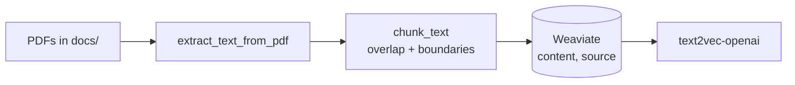

# Code Walkthrough — Agentic Production Framework

This document walks through all code files and explains the **code flow** from an incoming chat request to the response, plus the GraphQL conversation-history API.

**Detailed (“deep dive”) sections** — These files have extra explanation of logic, data structures, and code flow:
- **§3.5** `intent_classifier.py` — INTENT_MAP, keyword vs TensorFlow classifier, synthetic training, classify logic.
- **§3.15** `conversation_store.py` — Turn, append/get/list behavior, in-memory implementation, who writes/reads.
- **§3.16** `faithfulness.py` — Stub vs TFFaithfulnessScorer, input format, synthetic data, aggregate usage.
- **§3.17** `guardrails.py` — GuardrailResult, input blocking patterns, output filtering and truncation.
- **§3.18** `rag.py` — RAGChunk, Stub vs Weaviate, connection and near_text retrieval.
- **§3.19** `history_rag.py` — Last-N turns retrieval, format_for_context, difference from ConversationStore.
- **§3.20** `hitl/` — Human-in-the-loop: HitlHandler, EscalationContext, stub/ticket/email handlers, get_hitl_handler, escalate_node usage.

---

## 1. Project structure (code)

```
Agentic_Production_Env/
├── main.py                    # Entry: runs FastAPI via uvicorn
├── src/
│   ├── __init__.py
│   ├── api.py                 # FastAPI app: /chat, /health, /graphql
│   ├── config.py              # Config from env (OPENAI_API_KEY, thresholds, AgentOps, etc.)
│   ├── agent_ops/             # AgentOps: circuit breaker, health
│   │   ├── __init__.py
│   │   ├── circuit_breaker.py # Per-agent circuit (closed/open/half_open)
│   │   └── health.py         # get_agent_ops_health for /health
│   ├── hitl/                  # Human-in-the-loop: escalation handlers
│   │   ├── __init__.py        # get_hitl_handler(stub | ticket | email)
│   │   ├── base.py            # HitlHandler ABC, EscalationContext
│   │   ├── stub.py            # StubHitlHandler (no-op)
│   │   ├── ticket.py          # TicketHitlHandler (create_support_ticket + pending)
│   │   └── email_notify.py    # EmailNotifyHitlHandler (log; optional email_to)
│   ├── router.py              # Session router: intent → suggested agent IDs
│   ├── supervisor.py          # LangGraph supervisor: route → invoke_agent → aggregate → escalate
│   ├── registry.py            # Agent registry (in-memory: support, billing, tech, escalation)
│   ├── agents/
│   │   ├── __init__.py
│   │   ├── base.py            # AgentState TypedDict for agent subgraphs
│   │   ├── support.py         # Support agent: RAG + history + tools + guardrails
│   │   └── billing.py        # Billing agent: same pattern
│   ├── tools/
│   │   ├── __init__.py
│   │   ├── support_tools.py   # search_knowledge_base, create_support_ticket
│   │   ├── billing_tools.py   # look_up_invoice, get_refund_status, create_refund_request
│   │   └── mcp_client.py     # Load MCP tools and merge with built-in
│   ├── graphql/
│   │   ├── __init__.py
│   │   └── conversation_schema.py  # Strawberry types + Query (conversation, sessions)
│   ├── ingestion/                  # RAG ingestion: PDF → chunk → Weaviate
│   │   ├── __init__.py
│   │   ├── __main__.py             # python -m src.ingestion
│   │   └── rag_ingest.py           # PDF load, chunk, Weaviate write + CLI
│   └── shared_services/
│       ├── __init__.py
│       ├── intent_classifier.py    # KeywordIntentClassifier, TFIntentClassifier
│       ├── conversation_store.py   # ConversationStore, Turn; append_turn, get_history, list_sessions
│       ├── faithfulness.py        # FaithfulnessScorer (Stub, TFFaithfulnessScorer)
│       ├── guardrails.py          # GuardrailService (Stub, SimpleGuardrailService)
│       ├── rag.py                 # RAGService (Stub, WeaviateRAGService)
│       ├── history_rag.py         # ConversationHistoryRAG (last N turns)
│       └── session_store.py       # SessionStore (in-memory stub; production: Redis)
├── mcp_server/                    # In-repo MCP server (register tools; run python -m mcp_server)
│   ├── __init__.py
│   ├── __main__.py
│   ├── server.py                  # FastMCP server, @mcp.tool() for tools
│   └── README.md
```

---

## 2. End-to-end request flow (chat)

High-level: **Client → POST /chat → Router → Supervisor graph → Agent → Reply → ConversationStore → Response.**

```
  Client
    │
    ▼ POST /chat { user_id, message, session_id? }
  api.py (chat endpoint)
    │
    ├─ 1) router_svc.route(user_id, message, session_id)
    │      → router.py SessionRouter.route()
    │         → intent_classifier.classify(message)  [KeywordIntentClassifier or TFIntentClassifier]
    │      → RouterResult(session_id, suggested_agent_pool_ids, embedding_cache_key)
    │
    ├─ 2) Build initial_state: { messages: [HumanMessage], session_id, user_id, suggested_agent_ids }
    │     config = { configurable: { thread_id } }   # for checkpointer
    │
    ├─ 3) supervisor.invoke(initial_state, config)
    │      → supervisor.py compiled StateGraph
    │         plan_node       → when USE_PLANNING: LLM picks agent → planned_agent_ids; else no-op
    │         route_node      → use planned_agent_ids or suggested_agent_ids; when AgentOps: skip circuit-open; pick current_agent
    │         invoke_agent_node → agents_map[current_agent](state); when AgentOps: record_success/record_failure; on exception try failover or friendly message + needs_escalation
    │         aggregate_node   → FaithfulnessScorer.score(response, last_rag_context); if < threshold → needs_escalation, escalation_reason
    │         (optional) escalate_node → build EscalationContext; hitl_handler.on_escalate(ctx); AIMessage "connecting you with a human agent"
    │      → result = { messages, current_agent, needs_escalation?, ... }
    │
    ├─ 4) Extract last AIMessage as reply; agent_id = result["current_agent"]
    │
    ├─ 5) conversation_store.append_turn(thread_id, "user", req.message)
    │      conversation_store.append_turn(thread_id, "assistant", reply, metadata={ agent_id })
    │
    └─ 6) return ChatResponse(session_id=thread_id, reply=reply, agent_id=agent_id)
```

---

## 3. File-by-file walkthrough

### 3.1 `main.py`

- **Purpose:** Application entry point.
- **Flow:** Runs uvicorn with `src.api:app`, host `0.0.0.0`, port 8000, reload enabled.
- **Effect:** HTTP server serves the FastAPI app defined in `src.api`.

---

### 3.2 `src/config.py`

- **Purpose:** Central configuration from environment variables.
- **Key:** `Config` dataclass; singleton `config`.
- **Values:** `OPENAI_API_KEY`, `DEFAULT_MODEL`, `HALLUCINATION_THRESHOLD_FAITHFULNESS` / `_CONFIDENCE`, `WEAVIATE_*`, `TOP_P`, `GUARDRAILS_ENABLED`, `USE_TF_INTENT`, `TF_INTENT_MODEL_PATH`, `USE_TF_FAITHFULNESS`, `TF_FAITHFULNESS_MODEL_PATH`; **AgentOps:** `AGENT_OPS_ENABLED`, `CIRCUIT_BREAKER_*`, `FAILOVER_*`, `AGENT_INVOCATION_TIMEOUT_SECONDS`; **Optional patterns:** `USE_PLANNING` (supervisor plan node), `USE_REACT` (agents use Thought/Action/Observation loop), `REACT_MAX_STEPS`.
- **Used by:** router (intent), supervisor (faithfulness, circuit_breaker, failover, plan node), agents (top_p, guardrails, ReAct), RAG (Weaviate URL/index), api (circuit breaker wiring, /health).

---

### 3.3 `src/api.py`

- **Purpose:** FastAPI app and HTTP entrypoints.
- **Setup:**
  - When `config.agent_ops_enabled`, creates `CircuitBreaker(threshold, cooldown)` and passes it to `build_supervisor(use_checkpointer=True, circuit_breaker=circuit_breaker)`; same instance used by `/health`. Creates `SessionRouter()`, `InMemoryConversationStore()`.
  - Builds Strawberry schema from `GraphQLQuery`, `GraphQLRouter` with context getter that injects `conversation_store`; mounts at `/graphql`.
- **Endpoints:**
  - **GET /health:** When AgentOps enabled, returns `{"status": "ok"|"degraded", "agents": {...}, "mcp": "ok"|"unavailable"}` and 503 when degraded; otherwise `{"status": "ok"}`.
  - **POST /chat:** (see Section 2)
    1. Calls `router_svc.route()` → `RouterResult`.
    2. Builds `initial_state` (messages, session_id, user_id, suggested_agent_ids) and `config` (thread_id for checkpointer). See §3.6 for where the full supervisor state is defined and persisted.
    3. `supervisor.invoke(initial_state, config)`.
    4. Takes last AI message as `reply`, `agent_id` from result.
    5. Appends user and assistant turns to `conversation_store`.
    6. Returns `ChatResponse(session_id, reply, agent_id)`.
  - **POST /graphql:** GraphQL API; context has `conversation_store` (see §3.14).
- **Models:** `ChatRequest` (user_id, message, session_id?), `ChatResponse` (session_id, reply, agent_id?).

---

### 3.4 `src/router.py`

- **Purpose:** Map a user message to a session and suggested agent pool IDs.
- **Types:** `RouterResult(session_id, suggested_agent_pool_ids, embedding_cache_key?)`.
- **SessionRouter:**
  - Constructor: uses `KeywordIntentClassifier()` by default, or `TFIntentClassifier(model_path)` when `config.use_tf_intent` is True.
  - `route(user_id, message, session_id?)`: uses `session_id` or generates new UUID; calls `self._classifier.classify(message)` → list of agent IDs; returns `RouterResult`.
- **Flow:** One call per chat request; output feeds supervisor’s `suggested_agent_ids` and `session_id`/thread_id.

---

### 3.5 `src/shared_services/intent_classifier.py` (detailed)

**Purpose:** Classify the user’s message into one or more intents and return suggested agent pool IDs (e.g. `["billing"]`, `["support"]`). This is the first decision in the pipeline: it does **not** call an LLM; it’s fast and deterministic (keyword) or small-model (TensorFlow).

**Constants:**
- **`INTENT_LABELS`:** Fixed list `["support", "billing", "tech", "escalation"]`. Index 0 = support (default).
- **`INTENT_MAP`:** List of `(keywords_tuple, agent_id)`:
  - `("invoice", "bill", "payment", "refund", "billing")` → `"billing"`
  - `("tech", "error", "bug", "install", "troubleshoot")` → `"tech"`
  - `("human", "agent", "escalate", "speak to someone")` → `"escalation"`
  If no row matches, the classifier returns `["support"]`.

**IntentClassifier (ABC):**
- Single method: `classify(message: str) -> list[str]` returning suggested agent IDs.

**KeywordIntentClassifier:**
- **Logic:** Lowercases the message, then iterates over `INTENT_MAP`. For each row, if **any** keyword in the tuple appears in the message, that row’s `agent_id` is appended to `suggested`. If no row matches, `suggested = ["support"]`. Returns `suggested` (so multiple intents can match, e.g. “invoice and refund” → `["billing"]`).
- **No ML:** Pure string matching; no model load, very fast.

**TFIntentClassifier:**
- **When used:** Router uses this when `config.use_tf_intent` is True (env `USE_TF_INTENT=true`) and passes `config.tf_intent_model_path` (or None).
- **Model path:** Default `project_root/.intent_model/model.keras`. Overridable via `TF_INTENT_MODEL_PATH`.
- **Lazy model load (`_get_model`):**
  1. If TensorFlow is not installed → returns `None` (classifier will use fallback).
  2. If `model_path` file exists → `keras.models.load_model(path)` and return (no TextVectorization in saved model by default in this setup; note: if you save/load, vectorizer state may need to be saved separately for production).
  3. Otherwise **train from synthetic data:**
     - **Synthetic data (`_synthetic_data`):** For each `(keywords, agent_id)` in `INTENT_MAP`, adds each keyword as a text with that label, plus a short phrase (first two keywords joined). Then adds several `"help"` and one `"hello"` as support. Returns `(texts, labels)` where labels are agent_id strings.
     - **TextVectorization:** `max_tokens=VOCAB_SIZE` (2000), `output_sequence_length=MAX_SEQ_LEN` (32), `output_mode="int"`. Adapted on `texts`.
     - **Model:** Input string → TextVectorization → Embedding(VOCAB_SIZE+1, 32) → GlobalAveragePooling1D → Dense(16, relu) → Dropout(0.2) → Dense(4, softmax). Compiled with adam, sparse_categorical_crossentropy. Labels converted to indices via `INTENT_LABELS.index(l)`. Trained for 8 epochs. Model saved to `model_path`.
- **classify(message):**
  1. Tries to get the model (`_get_model`). On exception or if model is None, returns `self._fallback.classify(message)` (KeywordIntentClassifier).
  2. Message is stripped or defaulted to `"help"`. Single prediction: `model.predict(tf.constant([msg]))[0]`.
  3. Argmax gives class index; value at that index is confidence. If confidence < 0.5, returns `["support"]`; else returns `[INTENT_LABELS[idx]]` (exactly one agent).
- **Flow:** Used only by `SessionRouter.route()`; output is `suggested_agent_pool_ids` in `RouterResult`.

---

### 3.6 `src/supervisor.py`

- **Purpose:** LangGraph supervisor: (optional) plan → route → invoke_agent → aggregate → (optional) escalate.
- **State:** `SupervisorState` (messages, current_agent, session_id, user_id, suggested_agent_ids, planned_agent_ids, metadata, needs_escalation, escalation_reason, resolved, last_rag_context).

**Where state is maintained:**
- **Schema:** State shape is defined in **`src/supervisor.py`** as the `SupervisorState` TypedDict (messages, current_agent, session_id, user_id, suggested_agent_ids, planned_agent_ids, metadata, needs_escalation, escalation_reason, resolved, last_rag_context).
- **Initial values:** **`src/api.py`** builds `initial_state` for each request: `messages` (one HumanMessage), `session_id` (= thread_id), `user_id`, `suggested_agent_ids` (from router). Other fields are set by graph nodes or carried over from the checkpointer.
- **Persistence:** State is stored in the **checkpointer** (`MemorySaver()` when `use_checkpointer=True`). LangGraph keys it by `config["configurable"]["thread_id"]` (same as session_id). On each request it loads previous state for that thread, merges with `initial_state`, runs the graph, and saves the result — so conversation history (messages, etc.) is maintained across turns.
- **Who updates what:** `plan_node` → planned_agent_ids; `route_node` → current_agent; `invoke_agent_node` → messages, resolved, needs_escalation, last_rag_context (and on failure can set needs_escalation); `aggregate_node` → needs_escalation, escalation_reason (e.g. low_faithfulness); `escalate_node` → messages (appends “connecting you with a human agent”). Session_id and user_id come from the API and are not changed by nodes.

- **Graph construction (`create_supervisor_graph`):**
  - Creates Support and Billing agents via `create_support_agent(rag)`, `create_billing_agent(rag)`; `agents_map = {"support": ..., "billing": ...}`.
  - **plan_node:** When `USE_PLANNING=true`, LLM picks which agent (support or billing) should handle the message; returns `{ planned_agent_ids: [agent_id] }`. When disabled, no-op.
  - **route_node:** Uses `planned_agent_ids` if set, else `suggested_agent_ids`; when AgentOps enabled, skips circuit-open; picks first available ID in `agents_map`; returns `{ current_agent }`.
  - **invoke_agent_node:** Calls `agents_map[current_agent](state)`. When AgentOps enabled: on success records `record_success(agent_id)`; on exception records `record_failure(agent_id)` and, if failover enabled, tries fallback agent (default support); if both fail, returns friendly AIMessage and sets needs_escalation. Returns messages, resolved, needs_escalation, last_rag_context.
  - **aggregate_node:** Gets last AI message and `last_rag_context`; runs `FaithfulnessScorer.score(response, context)`; if score < `config.hallucination_threshold_faithfulness` sets `needs_escalation=True`.
  - **escalate_node:** Appends AIMessage “I'm connecting you with a human agent. Please hold.”
  - Edges: entry → plan → route → invoke_agent → aggregate; conditional from aggregate to escalate or END; escalate → END.
- **FaithfulnessScorer:** Injected or default: `TFFaithfulnessScorer` when `config.use_tf_faithfulness` else `StubFaithfulnessScorer`.
- **build_supervisor:** Accepts optional `circuit_breaker`; compiles graph with `MemorySaver()` checkpointer when `use_checkpointer=True`. API passes shared circuit breaker so `/health` and supervisor use the same instance.
- **Flow:** Single `invoke(initial_state, config)` runs the full graph; result is used by `api.chat()` to get messages and current_agent.

---

### 3.7 `src/registry.py`

- **Purpose:** Agent metadata (capabilities, model, limits). Used by supervisor/design; agents are actually created in supervisor from code (support/billing).
- **AgentConfig:** agent_id, capabilities, model, max_concurrent, latency_p99_ms.
- **AgentRegistry (ABC):** `get_agents_by_capability(capabilities)`, `get_agent(agent_id)`.
- **InMemoryAgentRegistry:** Predefined support, billing, tech, escalation configs. Not used in current graph wiring (agents_map is built in supervisor from create_*_agent).

---

### 3.8 `src/agents/base.py`

- **Purpose:** Shared state type for agent subgraphs.
- **AgentState (TypedDict):** messages (with add_messages), context, resolved, needs_escalation, metadata. Agents receive a dict with at least `messages`; they return a dict with messages and optional resolved, needs_escalation, last_rag_context.

---

### 3.9 `src/agents/support.py`

- **Purpose:** Support agent: guardrails → RAG + conversation history → LLM with tools (incl. MCP) → guard_output.
- **create_support_agent(rag, model, history_rag, guardrail):** Builds SupportAgent with StubRAGService/StubGuardrailService or SimpleGuardrailService when guardrails enabled; ConversationHistoryRAG; tools = support_tools + MCP tools.
- **SupportAgent.__call__(state):**
  1. Get last HumanMessage; if none, return short fallback.
  2. `guardrail.guard_input(query)` → if not passed, return “I can only help with support questions…”.
  3. `rag.retrieve(query, top_k=3)` → doc_context; `history_rag.format_for_context(messages, max_turns=10)` → history_context.
  4. Build system + user prompt; when USE_REACT call `_invoke_react(prompt_msgs)` else `_invoke_with_tools(prompt_msgs)`.
  5. `guardrail.guard_output(content)` → filtered text.
  6. Return messages, resolved (heuristic: no “unsure”/“escalat”), needs_escalation (heuristic: “escalat” or “ticket”), last_rag_context.
- **_invoke_with_tools:** Invokes LLM with bound tools; if tool_calls, runs each tool, appends ToolMessage, recurs until no tool calls; returns final AIMessage.
- **_invoke_react:** When `USE_REACT=true`, ReAct loop (Thought → Action → Action Input → Observation) until "Final Answer:"; same tools, max `REACT_MAX_STEPS`.

---

### 3.10 `src/agents/billing.py`

- **Purpose:** Same structure as Support, tuned for billing (invoices, refunds).
- **create_billing_agent:** Same pattern; BillingAgent uses billing_tools + MCP.
- **BillingAgent.__call__:** Same flow as Support; when USE_REACT uses _invoke_react else _invoke_with_tools; resolved/needs_escalation heuristics based on “contact”/“billing team”.

---

### 3.11 `src/tools/support_tools.py`

- **Purpose:** LangChain `@tool` functions for the Support agent. The LLM can call these during the tool-calling loop (e.g. to search the KB or create a ticket). MCP tools are merged with these via `get_tools_with_mcp(built_in)` in the agent.
- **search_knowledge_base(query: str):** Stub implementation: returns a fixed string like `"[Stub KB] Found 2 articles for '<query>'…"`. Production would call your KB or Weaviate. The docstring tells the LLM when to use it (FAQs, products, how-to).
- **create_support_ticket(subject, description, priority="normal"):** Stub: returns a string with a fake ticket ref (hash of description). Production would call a ticketing API. Docstring: use when the user needs escalation or the bot cannot resolve.
- **get_support_tools():** Returns `[search_knowledge_base, create_support_ticket]`. Used by SupportAgent to build the full tool list with MCP.

---

### 3.12 `src/tools/billing_tools.py`

- **Purpose:** LangChain `@tool` functions for the Billing agent. Used with MCP tools in the same way as support tools.
- **look_up_invoice(invoice_id: str):** Stub: returns a string like `"[Stub] Invoice <id>: status=paid, amount=$150.00…"`. Production: call billing API. Docstring: use when the user asks about a specific invoice or payment status.
- **get_refund_status(refund_id: str):** Stub: returns placeholder status (e.g. “processing, 5-7 business days”). Production: billing API.
- **create_refund_request(order_id, reason, amount_cents=None):** Stub: if `amount_cents` is given, formats as dollar amount; else “full” refund. Returns a ref ID (hash of order_id). Production: submit refund request to billing.
- **get_billing_tools():** Returns `[look_up_invoice, get_refund_status, create_refund_request]`.

---

### 3.13 `src/tools/mcp_client.py`

- **Purpose:** Load tools from an **MCP (Model Context Protocol) server** and merge them with the built-in LangChain tools. In this project MCP is **required**: `MCP_SERVER_URL` must be set, or tool loading fails.
- **load_mcp_tools_sync(server_url=None):** If `langchain-mcp-adapters` is not installed, raises. Reads URL from `server_url` or env `MCP_SERVER_URL`; if empty, raises. Uses MCP `streamablehttp_client(url)` and `ClientSession`; calls `load_mcp_tools(session)` (from the adapter) to get a list of LangChain tools. Runs the async load via `asyncio.run(_load())`. On any exception, raises with a clear message. Returns the list of MCP tools.
- **get_tools_with_mcp(built_in_tools):** Copies `built_in_tools` (e.g. from `get_support_tools()` or `get_billing_tools()`), calls `load_mcp_tools_sync()`, extends the list with MCP tools, and returns the combined list. So each agent’s `self.tools` = built-in + MCP; the LLM can invoke any of them by name during the tool-calling loop.

**Where to register tools:** This repo has **no MCP server** in `src/` — only the **client** above. You have two options: (1) **Built-in tools:** add LangChain `@tool` functions in `src/tools/support_tools.py` or `src/tools/billing_tools.py` and include them in `get_support_tools()` / `get_billing_tools()`. (2) **MCP tools:** use the in-repo MCP server in **`mcp_server/`** — register tools there with `@mcp.tool()` in `mcp_server/server.py`, run the server (`python -m mcp_server`), and set `MCP_SERVER_URL` (e.g. `http://localhost:8000/mcp`). See **`mcp_server/README.md`** for how to run and register MCP tools.

---

### 3.13a `src/agent_ops/` (AgentOps: circuit breaker, health)

- **Purpose:** **Circuit breaker** (per-agent: avoid calling failing agents for a cooldown), **failover** (try fallback agent on failure), and **health** payload for `GET /health`. See Architecture Design §5.4.1.
- **Reactive only:** Circuit state is updated **only on invocation** (when the supervisor calls an agent). There are no background or proactive health checks; “unhealthy” means the last N invocations of that agent failed.
- **circuit_breaker.py:** `CircuitBreaker(failure_threshold, cooldown_seconds)` — per-agent state (closed / open / half_open). `record_success(agent_id)`, `record_failure(agent_id)`, `is_available(agent_id)` (true if closed or half_open; open → half_open after cooldown). Used by supervisor route (filter) and invoke_agent (record + failover).
- **health.py:** `get_agent_ops_health(circuit_breaker, agent_ids, mcp_available)` → `{"status": "ok"|"degraded", "agents": {id: "healthy"|"circuit_open"|"half_open"}, "mcp": "ok"|"unavailable"}`. API uses this for `/health` and returns 503 when status is degraded.
- **Config (config.py):** `AGENT_OPS_ENABLED`, `CIRCUIT_BREAKER_FAILURE_THRESHOLD`, `CIRCUIT_BREAKER_COOLDOWN_SECONDS`, `FAILOVER_ENABLED`, `FAILOVER_FALLBACK_AGENT_ID`, `AGENT_INVOCATION_TIMEOUT_SECONDS`.

---

### 3.13b `mcp_server/` (in-repo MCP server)

- **Purpose:** MCP server run separately; the main app’s MCP client (`src/tools/mcp_client.py`) connects to `MCP_SERVER_URL` and loads tools from it. Register MCP tools here so they are merged with built-in Support/Billing tools.
- **server.py:** FastMCP app with `@mcp.tool()` decorators (e.g. `ping`, `echo`); run with streamable-http. Env: `MCP_HOST`, `MCP_PORT` (default 8000).
- **__main__.py:** Enables `python -m mcp_server`. **README.md:** How to run and add tools.

---

### 3.14 `src/graphql/conversation_schema.py`

- **Purpose:** GraphQL API for reading conversation history.
- **Types:** `Turn` (role, content, metadata_json), `Conversation` (session_id, turns), `SessionInfo` (session_id). `Turn.from_store_turn(store_turn)` builds from ConversationStore Turn.
- **Query:** Root type `Query`.
  - **conversation(session_id, limit?):** From context gets `conversation_store`; calls `get_history(session_id, limit)`; returns Conversation or null.
  - **sessions(limit?):** Calls `list_sessions(limit)`; returns list of SessionInfo.
- **Flow:** POST /graphql with query string; Strawberry resolves with context from `get_graphql_context()` in api.py (same `conversation_store` as /chat).

---

### 3.15 `src/shared_services/conversation_store.py` (detailed)

**Purpose:** **Long-term** persistence of conversation turns per session. This is separate from the in-memory “conversation history” used inside the agent prompt (ConversationHistoryRAG): here we **append** every user and assistant message after the supervisor responds, and **read** them back for dashboards, analytics, or the GraphQL API. Production would use DynamoDB (or similar) keyed by `session_id`.

**Turn (dataclass):**
- **`role: str`** — Typically `"user"` or `"assistant"` (or `"system"` if ever stored).
- **`content: str`** — The message text.
- **`metadata: Optional[dict]`** — Optional extra data (e.g. `{"agent_id": "billing"}` for assistant turns).

**ConversationStore (ABC):**
- **`append_turn(session_id, role, content, metadata=None)`** — Append one turn to the session’s history.
- **`get_history(session_id, limit=None)`** — Return list of `Turn` for that session; if `limit` is set, return only the **last** `limit` turns (so `limit=20` gives the 20 most recent).
- **`list_sessions(limit=None)`** — Return session IDs (e.g. for admin list or GraphQL `sessions` query). Order is not guaranteed in the in-memory stub.

**InMemoryConversationStore:**
- **Storage:** `_history: dict[str, list[Turn]]` — key = `session_id`, value = list of turns in order.
- **append_turn:** If `session_id` is not in `_history`, initializes `_history[session_id] = []`. Then appends `Turn(role=role, content=content, metadata=metadata)`. So turns are appended in chronological order.
- **get_history:** `turns = self._history.get(session_id, [])`. If `limit` is set, returns `turns[-limit:]` (last N). Otherwise returns the full list.
- **list_sessions:** `ids = list(self._history.keys())`. If `limit` is set, returns `ids[:limit]` (first N keys; order is insertion order in CPython but not guaranteed by the interface). Otherwise returns all keys.
- **Flow:** In `api.chat`, after the supervisor returns, the API calls `conversation_store.append_turn(thread_id, "user", req.message)` and `conversation_store.append_turn(thread_id, "assistant", reply, metadata={"agent_id": agent_id})`. GraphQL resolvers in `conversation_schema.py` receive the same store via context and call `get_history(session_id, limit)` for the `conversation` query and `list_sessions(limit)` for the `sessions` query.

---

### 3.16 `src/shared_services/faithfulness.py` (detailed)

**Purpose:** Assign a **faithfulness score** in [0, 1] to the pair (agent response, RAG context). High score = response is grounded in the context; low score = possible hallucination or contradiction. The supervisor uses this in the **aggregate** node: if score < `config.hallucination_threshold_faithfulness` (default 0.8), it sets `needs_escalation=True` so the graph can route to the escalate node (“connecting you with a human agent”).

**FaithfulnessScorer (ABC):**
- **`score(response: str, context: str) -> float`** — Returns a value in [0, 1]; higher means more faithful to context.

**StubFaithfulnessScorer:**
- **score:** Always returns `1.0`. No escalation is triggered by score when this is used (default when `USE_TF_FAITHFULNESS` is false).

**TFFaithfulnessScorer:**
- **When used:** Supervisor uses this when `config.use_tf_faithfulness` is True (env `USE_TF_FAITHFULNESS=true`). Model path from `config.tf_faithfulness_model_path` or default below.
- **Model path:** Default `project_root/.faithfulness_model/model.keras`; overridable via `TF_FAITHFULNESS_MODEL_PATH`.
- **Input format (`_format_input(response, context)`):** Single string: `"[RESPONSE] " + response[:500].strip() + " [CONTEXT] " + context[:500].strip()`. So the model sees one concatenated string (response and context truncated to 500 chars each).
- **Lazy model load (`_get_model`):**
  1. If TensorFlow is not installed → returns None (scorer falls back to stub).
  2. If `model_path` file exists → loads with `keras.models.load_model(path)` and returns.
  3. Otherwise **train from synthetic data:**
     - **Synthetic data (`_synthetic_data`):** Builds lists `texts` and `labels` (float 0.0 or 1.0). **Faithful (1.0):** Pairs like (“The invoice total is $100.”, “The invoice total is $100. Due in 30 days.”), (“Your refund was processed.”, “Your refund was processed. Allow 5-7 days.”), plus many repeats of (“The answer is 42.”, “The answer is 42. Please confirm.”) and (“Refunds are allowed within 30 days.”, “Refund policy: 30 days. No exceptions.”). **Unfaithful (0.0):** Pairs where response contradicts context (e.g. “The invoice total is $999” vs “$100”), or invents (“Random claim 12345.” vs “Unrelated context here.”). Each pair is turned into one string via `_format_input(resp, ctx)`.
     - **TextVectorization:** max_tokens=3000, output_sequence_length=128, output_mode="int"; adapted on `texts`.
     - **Model:** Input string → TextVectorization → Embedding → GlobalAveragePooling1D → Dense(16, relu) → Dropout(0.2) → Dense(1, sigmoid). Binary cross-entropy; 10 epochs. Saved to `model_path`.
- **score(response, context):**
  1. Gets model (`_get_model`); on exception or None, returns `self._fallback.score(response, context)` (stub = 1.0).
  2. Builds input string with `_format_input(response, context)`; runs `model.predict(...)[0][0]` and returns that float.
- **Flow:** Called once per turn in supervisor **aggregate_node** with the last AI message content and `last_rag_context` from the agent. Result compared to `config.hallucination_threshold_faithfulness`.

---

### 3.17 `src/shared_services/guardrails.py` (detailed)

**Purpose:** Enforce safety and policy: block or filter user **input** (before the agent processes it) and agent **output** (before returning to the user). Prevents off-topic, toxic, or policy-violating content from entering or leaving the system.

**GuardrailResult (dataclass):**
- **`passed: bool`** — True if the content is allowed; False if input should be rejected (agent will not process it).
- **`filtered_text: str`** — For input: original text when passed, or still the original when blocked (caller uses `passed` to decide). For output: the text after filtering/truncation.
- **`reason: Optional[str]`** — Optional reason for failure (e.g. `"input_blocked:hack"`, `"empty"`).

**GuardrailService (ABC):**
- **`guard_input(text: str) -> GuardrailResult`** — Validate user message; if not passed, the agent typically returns a canned “I can only help with…” message.
- **`guard_output(text: str) -> GuardrailResult`** — Validate/filter the agent’s reply before it is shown to the user (e.g. remove secrets, truncate).

**StubGuardrailService:**
- **guard_input:** Always returns `GuardrailResult(passed=True, filtered_text=text)`.
- **guard_output:** Same. Use when guardrails are disabled (`GUARDRAILS_ENABLED=false`) or for tests.

**SimpleGuardrailService (keyword-based):**
- **Input blocking (`_INPUT_BLOCK_PATTERNS`):** Frozen set of substrings (case-insensitive): `"hack"`, `"exploit"`, `"ddos"`, `"password crack"`, `"credential steal"`. If the user message is empty or whitespace-only → `passed=False`, `reason="empty"`. If any pattern appears in the lowercased message → `passed=False`, `reason="input_blocked:<pattern>"`, `filtered_text` unchanged (caller should not use it; agent returns a safe fallback). Otherwise → `passed=True`, `filtered_text=text`.
- **Output filtering (`_OUTPUT_BLOCK_PATTERNS`):** Frozen set: `"internal api key"`, `"secret token"`, `"admin password"`. Output is **never** rejected; instead, each occurrence of a pattern is **replaced** with `"[content removed]"` (case-insensitive find, replace in string, then re-check lowercased string for next pattern). After that, if length exceeds `_MAX_OUTPUT_LEN` (4000), the text is truncated to 4000 chars and `"\n[...truncated]"` is appended. Returns `GuardrailResult(passed=True, filtered_text=filtered)`.
- **Flow:** Support and Billing agents call `guard_input(query)` at the start of `__call__`; if not passed, they return immediately with a fixed message. After the LLM/tool loop they call `guard_output(content)` and use `.filtered_text` as the final reply content.

- **Prompt-injection patterns:** `SimpleGuardrailService` also blocks common injection/jailbreak phrases (e.g. “ignore previous instructions”, “disregard your instructions”) and rejects input longer than 8000 chars. See ARCHITECTURE_DESIGN for optional third-party libraries (Guardrails AI, LLM Guard, etc.) that implement the same interface for stronger runtime checks. **Giskard** is for **CI/pre-release scanning** only (it does not run on each user request in production); use it in tests to find vulnerabilities before deploy.

---

### 3.18 `src/shared_services/rag.py` (detailed)

**Purpose:** **Retrieval-Augmented Generation (RAG):** fetch relevant document chunks for a user query so the agent can ground its answer in your knowledge base (KB) instead of relying only on the LLM’s training. Used by both Support and Billing agents to build a “document context” string that is pasted into the prompt.

**RAGChunk (dataclass):**
- **`content: str`** — The text of the chunk (snippet from a doc or KB).
- **`source: Optional[str]`** — e.g. document ID or filename (for citations).
- **`score: Optional[float]`** — Relevance score from the vector search (if available).

**RAGService (ABC):**
- **`retrieve(query: str, top_k: int = 5, filters: Optional[dict] = None) -> list[RAGChunk]`** — Returns up to `top_k` chunks most relevant to `query`; `filters` can narrow by metadata in production.

**StubRAGService:**
- **retrieve:** Ignores `filters`. Always returns a list of **one** chunk (sliced to `top_k`): `RAGChunk(content=f"Stub context for: {query[:50]}...", source="stub_doc_1", score=0.95)`. So with `top_k=3` you still get only one stub chunk. Used when no Weaviate or real KB is configured; agents still get a consistent prompt shape.

**WeaviateRAGService:**
- **Constructor:** `url` (e.g. from `WEAVIATE_URL`), `index_name` (default `"RAGChunks"`; overridable via `WEAVIATE_INDEX`). Client is lazily created in `_get_client()`.
- **Connection (`_get_client`):** Parses `url` (host, port, scheme). For localhost/127.0.0.1 uses `weaviate.connect_to_local(host, port, grpc_port=50051)`; otherwise `weaviate.connect_to_custom(http_host, http_port, http_secure)`. Raises if `weaviate` is not installed or connection fails.
- **retrieve(query, top_k=5, filters?):** Gets the Weaviate collection by `index_name`; runs **near_text** semantic search with `query` and `limit=top_k`. For each returned object, reads `content` and optional `source` from properties, and metadata score if present; builds a list of `RAGChunk`. If the list is empty, returns a single chunk with “No Weaviate results for: …”. On any exception, returns a single chunk whose content describes the error (so the agent doesn’t crash and can say “retrieval failed”).
- **Flow:** In Support and Billing agents, `chunks = self.rag.retrieve(query, top_k=3)`; then `doc_context = "\n".join(c.content for c in chunks)` and this string is included in the HumanMessage passed to the LLM (and also returned as `last_rag_context` for the faithfulness scorer).

**RAG ingestion (vector DB write) — implemented in `src/ingestion/`**

**Ingestion flow (high-level)**



- **Read path:** `WeaviateRAGService.retrieve()` runs `near_text` on an existing collection (see above).
- **Write path:** The **RAG ingestion** module `src/ingestion/rag_ingest.py` loads **PDF files** from a directory, chunks the text, and writes to Weaviate:
  1. **Load:** `extract_text_from_pdf(path)` uses **pypdf** to extract text from each page; `list_pdfs(directory)` finds all `.pdf` files in the given dir (e.g. `docs/`).
  2. **Chunk:** `chunk_text(text, chunk_size=500, overlap=50)` uses **overlapping, boundary-aware, character-based chunking**: target size and overlap in characters (defaults 500 and 50); chunk end is snapped to the nearest break (paragraph → sentence → word) so chunks do not cut mid-word. Minimum chunk size 20 characters. See “Chunking strategy” below.
  3. **Weaviate:** `get_weaviate_client(url)` connects (same logic as `rag.py`). `ensure_collection(client, index_name, recreate)` creates the collection with **text2vec-openai** vectorizer and properties `content`, `source` if it does not exist (or deletes and recreates when `--recreate`). `insert_chunks_weaviate(client, index_name, chunks)` inserts each `(content, source)` pair; Weaviate’s vectorizer embeds them (requires Weaviate to have `OPENAI_APIKEY` or the key passed at connection).
  4. **CLI:** Run from project root:  
     `python -m src.ingestion --input-dir docs [--weaviate-url URL] [--index NAME] [--chunk-size 500] [--overlap 50] [--recreate]`  
     Uses `WEAVIATE_URL` and `WEAVIATE_INDEX` from env if not passed. Put PDFs in `docs/` (or another dir) and run the command to populate the RAG collection for the agents.

---

### 3.19 `src/shared_services/history_rag.py` (detailed)

**Purpose:** Give the agent **recent conversation history** in the same turn so it can handle multi-turn “issue handling” (e.g. “What was that invoice ID?” referring to an earlier message). This is **in-memory history within the current request**: the `messages` list comes from the supervisor state for this thread, not from the long-term ConversationStore. Production could replace this with a vector index over past turns (e.g. Weaviate) and semantic retrieval.

**HistoryChunk (dataclass):**
- **`content: str`** — Text of the message.
- **`role: str`** — `"user"` or `"assistant"`.
- **`turn_index: int`** — Index in the slice (for ordering).

**ConversationHistoryRAG:**
- **Constructor:** `max_turns: int = 10` — default number of recent turns to consider.
- **retrieve(messages, query, top_k=None):**
  - `k = top_k or self.max_turns`. Takes the **last k messages** from `messages` (i.e. most recent): `messages[-k:]`.
  - For each message, gets `content` (skip if empty), determines `role` from type: `HumanMessage` → `"user"`, else `"assistant"`. Appends `HistoryChunk(content=..., role=..., turn_index=i)`.
  - **Note:** `query` is unused in this simple implementation; it’s there for a future semantic-search API. Currently “retrieval” is just “last N turns.”
- **format_for_context(messages, max_turns=10):**
  - Calls `retrieve(messages, "", top_k=max_turns)` to get chunks.
  - If no chunks, returns `"(No previous conversation)"`.
  - Otherwise builds lines: for each chunk, `"User: " + content` or `"Agent: " + content`; joins with newlines. So the prompt gets a block like:
    ```
    User: I need help with invoice INV-001
    Agent: I found invoice INV-001, amount $100.
    User: What was that amount again?
    ```
- **Flow:** Support and Billing agents call `history_rag.format_for_context(messages, max_turns=10)` and embed that string in the HumanMessage (e.g. “Conversation history (for issue handling):\n{history_context}\n\nDocument context: … Current user message: …”). The same `messages` are the LangGraph state messages for this thread (from the checkpointer).

---

### 3.20 `src/hitl/` (HITL — human-in-the-loop) (detailed)

**Purpose:** When the supervisor escalates (low faithfulness or agent-requested), the **escalate** node calls a **HITL handler** so the system can create tickets, notify humans, or enqueue for a human queue. The module is separate so you can plug in different back ends (stub, ticket, email) without changing the supervisor.

**base.py:** **EscalationContext** (dataclass): `session_id`, `user_id`, `reason` (e.g. `"low_faithfulness"`, `"agent_requested"`), `last_user_message`, `last_agent_message`, `metadata`. **HitlHandler (ABC):** `on_escalate(ctx: EscalationContext) -> None`.

**stub.py:** **StubHitlHandler** — `on_escalate` no-op. Used when `HITL_ENABLED=false` or `HITL_HANDLER=stub`.

**ticket.py:** **TicketHitlHandler** — In `on_escalate(ctx)` invokes `create_support_ticket` (support_tools) with subject/description/priority from context; stores in `_pending_escalations[session_id]`. **get_pending_escalations()**, **clear_pending_escalation(session_id)** for API/dashboard.

**email_notify.py:** **EmailNotifyHitlHandler** — Logs escalation; optional `email_to` (SMTP not implemented).

**__init__.py:** **get_hitl_handler(handler_name, enabled, email_to=None)** — Returns StubHitlHandler if not enabled or handler=stub; TicketHitlHandler for `ticket`; EmailNotifyHitlHandler for `email`.

**Flow:** Supervisor **escalate_node** builds `EscalationContext` from state, calls `hitl_handler.on_escalate(ctx)` (try/except), returns AIMessage "I'm connecting you with a human agent. Please hold." **GET /hitl/pending** and **POST /hitl/pending/{session_id}/clear** in api.py.

---

### 3.21 `src/shared_services/session_store.py`

- **Purpose:** Abstract interface for **short-term** session state (e.g. for a checkpointer or session cache). In production this could be Redis with TTL. **Note:** The supervisor currently uses LangGraph’s **MemorySaver** (in-memory checkpointer) keyed by `thread_id`; it does **not** use this `SessionStore` class. This module is available for future use (e.g. custom session cache or Redis-backed checkpointer).
- **SessionStore (ABC):** `get(session_id) -> Optional[Any]`; `set(session_id, state, ttl_seconds=86400)`. TTL is for expiration (e.g. 24h).
- **InMemorySessionStore:** Backed by a dict `_store[session_id] = state`. `get` returns the value or None; `set` stores the state (TTL is not enforced in this stub; a real Redis impl would use it).

---

### 3.22 `src/ingestion/` (RAG ingestion)

- **Purpose:** Populate the Weaviate RAG collection from **PDF files**: load PDFs → extract text → chunk → insert into Weaviate (with text2vec-openai so Weaviate embeds on insert).
- **Layout:** `ingestion/rag_ingest.py` holds PDF extraction, chunking, Weaviate client/collection/insert, and the CLI; `ingestion/__main__.py` delegates to `rag_ingest.main()` so the package is runnable as a module.
- **PDF:** `extract_text_from_pdf(path)` (pypdf), `list_pdfs(directory)` for `*.pdf`. **Chunking:** see “Chunking strategy” below. **Weaviate:** `get_weaviate_client(url)`, `ensure_collection(client, index_name, recreate)` (create with `content` + `source` and text2vec-openai), `insert_chunks_weaviate(client, index_name, list of (content, source))`.
- **Chunking strategy:** Overlapping, boundary-aware, character-based. Target **chunk_size** (default 500) and **overlap** (default 50) in characters. Split points are computed from paragraph (`\n\n+`), newline (`\n`), sentence (`[.!?]\s+`), and word (`\s+`) boundaries; the end of each chunk is snapped to the nearest such point so chunks do not cut mid-word. Next chunk starts at `end - overlap`. Chunks shorter than **min_chunk_size** (20) are skipped. Configurable via CLI: `--chunk-size`, `--overlap`.
- **CLI:** `python -m src.ingestion --input-dir docs [--weaviate-url] [--index] [--chunk-size 500] [--overlap 50] [--recreate]`. Requires `WEAVIATE_URL`; Weaviate server needs OpenAI API key for the vectorizer. See §3.18 (rag.py) for the ingestion write path.

---

## 4. Data flow summary

| Step | Data | Where |
|------|------|--------|
| 1 | user_id, message, session_id? | ChatRequest → router.route() |
| 2 | session_id, suggested_agent_pool_ids | RouterResult → initial_state |
| 3 | messages, session_id, user_id, suggested_agent_ids | Supervisor state; checkpointer keyed by thread_id |
| 4 | current_agent | route_node → state |
| 5 | messages, resolved, needs_escalation, last_rag_context | invoke_agent_node → aggregate_node |
| 6 | needs_escalation (from faithfulness) | aggregate_node → conditional edge |
| 7 | reply (last AI content), agent_id | api.chat from result |
| 8 | (thread_id, user message), (thread_id, assistant reply) | conversation_store.append_turn (two calls) |
| 9 | session_id, reply, agent_id | ChatResponse |

GraphQL reads: same `conversation_store` via get_history / list_sessions.

---

## 5. Configuration and environment

- **Required:** `OPENAI_API_KEY` (for LLM). `MCP_SERVER_URL` required if agents use MCP (default: they do via get_tools_with_mcp).
- **Optional:** `USE_TF_INTENT`, `TF_INTENT_MODEL_PATH`; `USE_TF_FAITHFULNESS`, `TF_FAITHFULNESS_MODEL_PATH`; `HALLUCINATION_THRESHOLD_FAITHFULNESS`; `GUARDRAILS_ENABLED`; `TOP_P`; `WEAVIATE_URL`, `WEAVIATE_INDEX` for production RAG. **AgentOps:** `AGENT_OPS_ENABLED` (default true), `CIRCUIT_BREAKER_FAILURE_THRESHOLD`, `CIRCUIT_BREAKER_COOLDOWN_SECONDS`, `FAILOVER_ENABLED`, `FAILOVER_FALLBACK_AGENT_ID`, `AGENT_INVOCATION_TIMEOUT_SECONDS`. **HITL:** `HITL_ENABLED` (default true), `HITL_HANDLER` (stub \| ticket \| email; default ticket), `HITL_EMAIL_TO` (for email handler).

---

*This walkthrough matches the codebase as of the last update and describes the path of a chat request and the role of each code file.*
