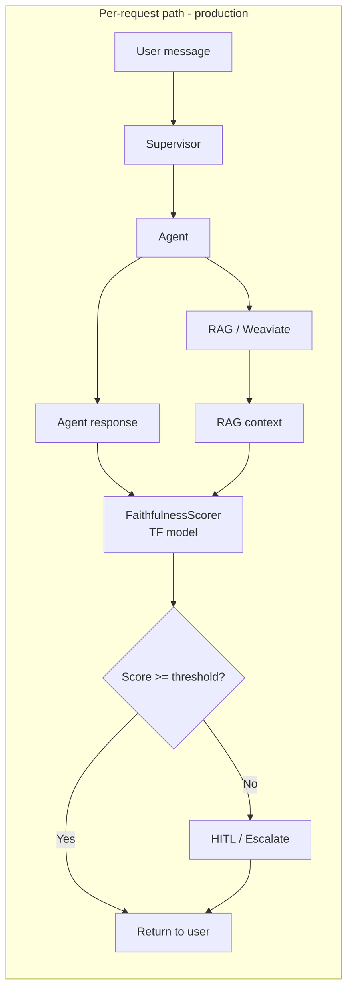
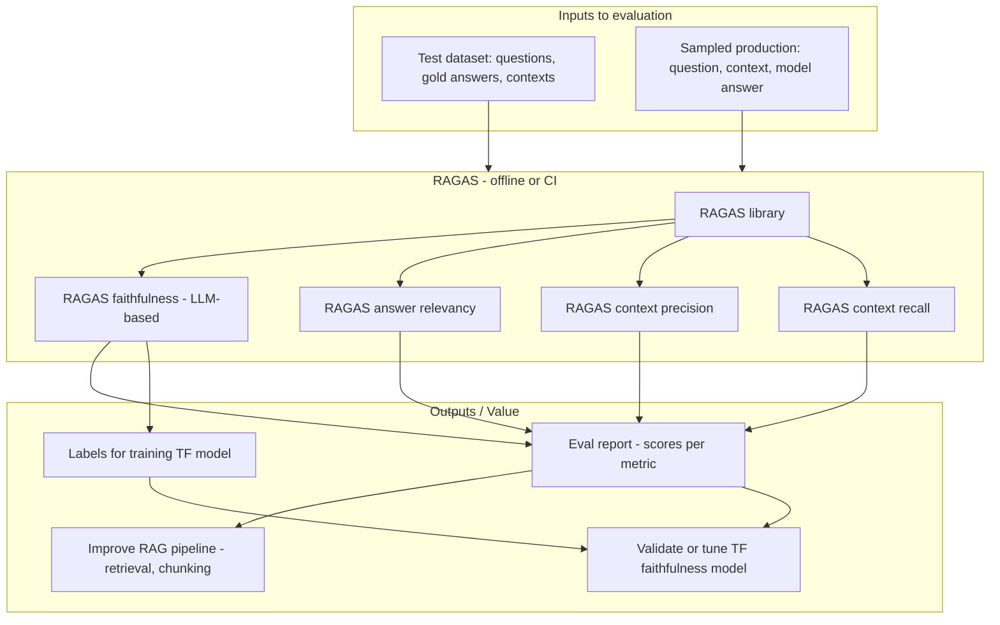
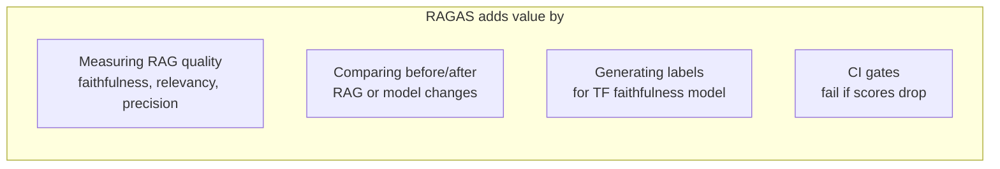

# Observability Details

This document is the main reference for **observability** in this project: **RAG evaluation (RAGAS)**, **runtime faithfulness** scoring, and **classic observability (Langfuse)**. It covers where each sits, how to run or enable it, and what is still missing.

---

## 1. Two Different Paths

| Path | Purpose | When it runs | What runs |
|------|--------|--------------|-----------|
| **Runtime (production)** | Score each response so supervisor can escalate if unfaithful | Every user request | `TFFaithfulnessScorer` in `src/shared_services/faithfulness.py` (small TF model) |
| **Evaluation (offline / CI)** | Measure RAG quality, improve pipeline, validate scorer | After deployments, on test sets, in CI | **RAGAS** (LLM-based metrics) |

---

## 2. Diagram: Runtime Path - Previous, No RAGAS

This is the **production request path** (unchanged). RAGAS does **not** sit here.



- **FaithfulnessScorer** = small TensorFlow model (or stub). No LLM call; low latency, low cost.
- Used only to decide: escalate to human or not.

---

## 3. Diagram: Where RAGAS Sits - Evaluation Path

RAGAS runs **outside** the request path: in **eval scripts**, **CI jobs**, or **notebooks**. It consumes **test data** (questions, retrieved contexts, answers) and produces **metrics**.



**Where RAGAS sits in the project (conceptually):**

```text
Agentic_Production_Env/
├── src/
│   ├── shared_services/
│   │   └── faithfulness.py     ← Runtime: TF scorer (unchanged)
│   └── ...
├── scripts/
│   └── eval_ragas.py           ← RAGAS eval script (implemented)
├── tests/
│   └── eval/                   ← Optional: CI eval with RAGAS
└── Documentation/
    └── Observability_Details.md  ← This file
```

RAGAS does **not** sit in `src/` on the request path. It runs in **scripts** (or CI) only.

**How to run RAGAS (implemented):**

1. Install: `pip install ragas` (see `requirements.txt`).
2. Set `OPENAI_API_KEY` (evaluator LLM and embeddings use OpenAI by default).
3. From repo root:
   - **Built-in sample:** `python scripts/eval_ragas.py`
   - **Custom data:** `python scripts/eval_ragas.py --data path/to/samples.json`
   - **Save results:** `python scripts/eval_ragas.py --output results.json`

JSON sample format: list of objects with `user_input`, `retrieved_contexts` (list of strings), `response`, and optionally `reference` (ground truth).

**Sample output of RAGAS evaluation metrics**

When you run `python scripts/eval_ragas.py` (or with `--output results.json`), the script prints (or writes) aggregate scores from RAGAS. All metrics are in the range 0–1; higher is better.

Example (built-in sample, 3 rows; exact numbers vary by evaluator LLM):

```json
{
  "faithfulness": 0.92,
  "answer_relevancy": 0.88
}
```

- **faithfulness** — Proportion of claims in the model's answer that are supported by the retrieved context (1 = fully grounded).
- **answer_relevancy** — How well the answer addresses the question (1 = fully relevant).

With `--output results.json`, the same JSON is written to the file. Per-sample scores (if your ragas version exposes them) would appear in a dataframe; the script currently reports **means** across the dataset.

---

## 4. How RAGAS Adds Value (Summary)



| Value | How |
|-------|-----|
| **Measure RAG quality** | Run RAGAS on (question, retrieved context, answer). Faithfulness = "Is answer grounded in context?" Relevancy, precision, recall = retrieval quality. |
| **Compare before/after** | After changing retrieval or chunking, re-run RAGAS on same test set; see if metrics improve. |
| **Validate / train TF model** | Use RAGAS faithfulness (or human labels) as ground truth; compare with `TFFaithfulnessScorer` scores; optionally use RAGAS outputs as labels to train the TF model. |
| **CI gate** | In CI, run RAGAS on a fixed eval set; fail the build if faithfulness (or other metric) drops below a threshold. |

---

## 5. Side-by-Side: Runtime vs RAGAS

| | Runtime (faithfulness.py) | RAGAS |
|--|---------------------------|--------|
| **Where** | `src/shared_services/faithfulness.py` | Scripts / tests / CI (e.g. `scripts/eval_ragas.py`) |
| **When** | Every request (in supervisor) | Offline / on demand / CI |
| **Mechanism** | Small TF model (or stub) | LLM-based evaluation |
| **Purpose** | Decide "escalate or not" | Evaluate pipeline, improve RAG, validate scorer |

So: **runtime** = TF scorer in the request path; **RAGAS** = evaluation layer that adds value by measuring and improving quality, and optionally feeding back into the TF model or RAG pipeline.

---

## 6. RAGAS and Observability

Adding RAGAS is **not** the same as adding classic request-level observability, but it can add **quality observability** and complements it.

| Kind | What it gives you | Examples |
|------|-------------------|----------|
| **Classic observability** | Understanding production as it runs: traces, logs, latency, errors, which node was called. | Langfuse, LangSmith, Prometheus, Grafana. "What is the system doing? Where did this request fail?" |
| **RAGAS (evaluation only)** | Quality metrics on test or sampled data, usually offline or in CI. | "How good is my RAG pipeline? Did it get better or worse after a change?" Not live observability. |
| **RAGAS as quality observability** | If you run RAGAS regularly on **sampled production conversations** and send scores to a dashboard or metrics system. | "How good are our RAG answers over time?" — observable quality trend. |

**Summary:** RAGAS adds **evaluation and (optionally) quality observability** to the agentic system. It does not replace request-level observability (traces, logs). It **complements** it: traces tell you *what* happened; RAGAS tells you *how good* the RAG answers are.

---

## 7. Classic Observability: Langfuse Implemented

**Langfuse** is implemented for classic LLM/agent observability. When enabled, each chat request is traced and the faithfulness score is attached to the trace.

| Area | Status | Notes |
|------|--------|--------|
| **LLM / agent traces** | **Implemented (Langfuse).** | Set `LANGFUSE_SECRET_KEY` (and `LANGFUSE_PUBLIC_KEY`, optional `LANGFUSE_BASE_URL`). The chat endpoint passes a Langfuse `CallbackHandler` to the supervisor `invoke()`; one trace per request with spans for LangGraph nodes, agent calls, and LLM steps. |
| **Scores on traces** | **Implemented.** | The supervisor writes `faithfulness_score` into state in `aggregate_node`. After `invoke()`, the API attaches this score to the Langfuse trace (`faithfulness`, 0–1). You can alert in the Langfuse dashboard when score &lt; threshold. |
| **Request / trace correlation** | **Implemented (session/user on trace).** | Each trace is sent with `session_id` and `user_id` via LangChain config metadata (`langfuse_session_id`, `langfuse_user_id`). Use these in Langfuse to filter and correlate. |
| **Application metrics** | Not implemented. | No `/metrics` endpoint (Prometheus). Only `/health`. |
| **Infrastructure metrics** | Not implemented. | No Prometheus scrape config or Grafana dashboards in repo. |

**How to enable Langfuse:** Add to `.env`: `LANGFUSE_SECRET_KEY=sk-lf-...`, `LANGFUSE_PUBLIC_KEY=pk-lf-...`, and optionally `LANGFUSE_BASE_URL=https://cloud.langfuse.com` (or your self-hosted URL). The app enables Langfuse when `LANGFUSE_SECRET_KEY` is set. Install: `pip install langfuse` (see `requirements.txt`). After a chat request, open your Langfuse project to see the trace, spans, and the **faithfulness** score.

**Still missing for full classic observability:** (1) `/metrics` endpoint and Prometheus/Grafana (or cloud equivalent) for app-level metrics; (2) structured logging with `trace_id` in log lines for joining logs with Langfuse traces. See **ARCHITECTURE_DESIGN.md** §9 and §10.
